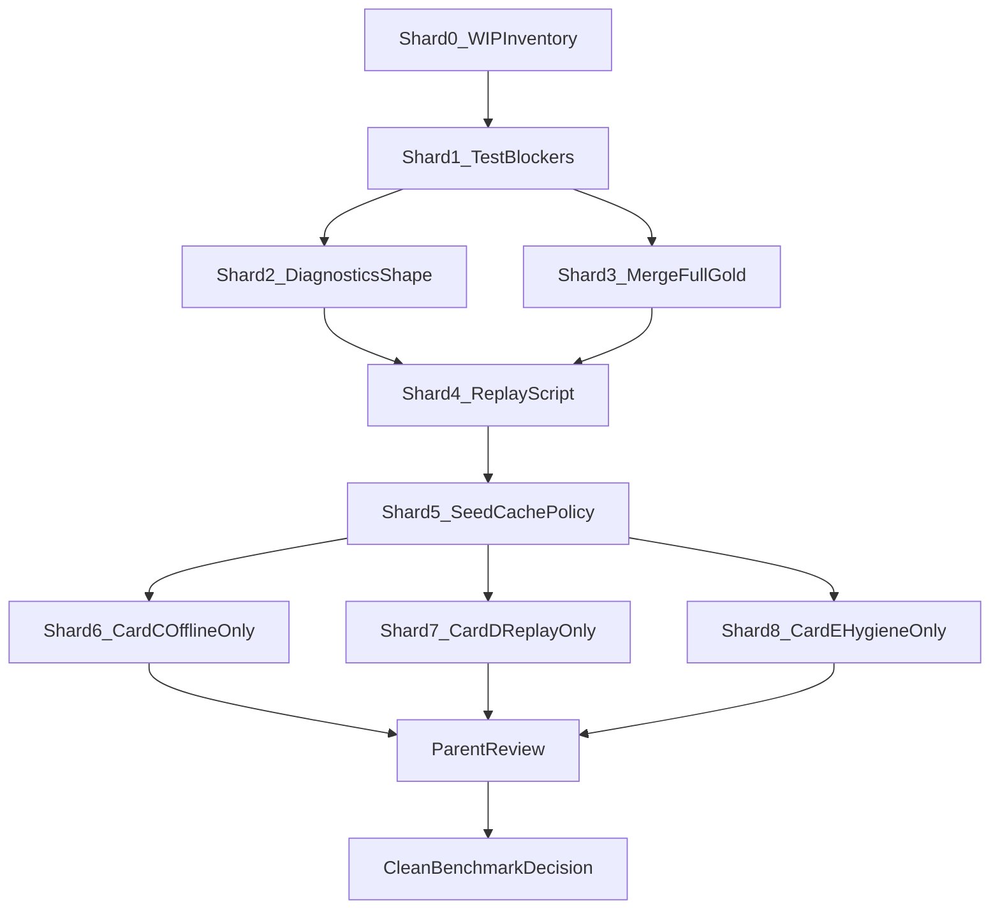

# Composer 2.5 Handoff: Recall Root Cause Levers Continuation

> **ARCHIVED 2026-07-09** — Composer handoff complete. Forward: `plans/claude/2026-07-09-recall-forward-after-concept-lock.md`.
>

> **Card ID**: `2026-07-07-composer-recall-root-cause-continuation`
> **Source/Background**: continuation of `.do-it/plans/claude/2026-07-06-recall-root-cause-and-levers.md`
> **Target**: `.worktrees/recall-root-cause-levers-2026-07-06` on branch `recall/root-cause-levers-2026-07-06`
> **Size**: L
> **Tier**: Heavy
> **Prerequisite**: preserve current worktree state; do not revert user/Codex changes
> **Blocks**: Phase 1 recall root-cause closeout, clean 100Q/500Q evidence, follow-up Card C/D/E implementation
> **Owner**: Composer 2.5 worker (one shard at a time); parent agent integrates, reviews, benchmark adjudication, commit
> **Grill**: source plan already contains grill/reflection decisions in §6-§8
> **Brainstorm**: none for this handoff

## 1. Background & Goal

Codex ran out of quota while working in:

```text
/home/tdwhere/vibe/Do-SOUL-Alaya/.worktrees/recall-root-cause-levers-2026-07-06
branch: recall/root-cause-levers-2026-07-06
```

The original strategic plan is:

```text
/home/tdwhere/vibe/Do-SOUL-Alaya/.do-it/plans/claude/2026-07-06-recall-root-cause-and-levers.md
```

Current work is not committed. It contains a large staged set for Card A/B/L5 foundations plus a smaller unstaged WIP set for script refinements and Card E hygiene. The immediate job is not to invent a new strategy. The job is to stabilize the current WIP, make the foundation trustworthy, and then continue the Phase 1 sequence with explicit gates.

Goal:

> Bring the current recall-root-cause-levers worktree to a reviewable, verified state, preserving Codex's useful Card A/B work, fixing current test failures, and leaving clear evidence for whether Composer should continue into Card C/D/E implementation or stop for parent review.

## Current Truth Snapshot

Confirmed on 2026-07-07 20:40-20:42 UTC+8:

- No benchmark/test process is running in the background.
- `lme-100q-concurrency4.log` is complete. The 100Q run finished and produced slug `2026-07-07T114758Z-60fed2f-policy-stress`.
- 100Q result: `R@1=62.0%`, `R@5=89.0%`, `R@10=91.0%`, `latency p50=382.161953ms`, `latency p95=1292.791276ms`.
- 100Q report verdict: `FAIL`.
- Numeric recall gate passed, budget-rate gate passed, but release evidence is **not clean** because seed extraction used `no_credentials_fallback` and 39 signals were dropped as `materialization_drop`.
- Latency hard gate failed: `recall_p95_embedding_on` 1292.791276ms > 1100ms.
- `rtk pnpm exec vitest run --project @do-soul/alaya-bench-runner` currently fails: 2 failed test files, 2 failed tests, 481 passed.
- Current staged diff: 23 files, about +2154/-17.
- Current unstaged diff: 5 files, about +285/-73.
- Two untracked tests exist and must be intentionally added or removed after inspection:
  - `apps/bench-runner/src/__tests__/longmemeval/abstention-calibration-script.test.ts`
  - `apps/bench-runner/src/__tests__/longmemeval/replay-longmemeval-diagnostics-script.test.ts`
- **Seed/cache layout**: main checkout has `.do-it/bench-runs/seeds/`; target worktree does **not** have `.do-it/bench-runs/seeds/**`. Benchmarks in the worktree must not assume a local seeds tree exists.

## Clean Benchmark Evidence Policy

The 100Q run `2026-07-07T114758Z-60fed2f-policy-stress` is **diagnostic-only evidence**. It must **not** be labeled clean, release-grade, or comparable to a credentialed baseline.

A run may be called **clean benchmark evidence** only when **all** of the following hold:

| Gate | Requirement |
| --- | --- |
| Seed path | `seed_extraction_path.path` is `official_api_compile` (or another explicitly approved credentialed path), **not** `no_credentials_fallback` |
| Materialization | `signals_dropped_by_reason.materialization_drop = 0` unless each drop is explained and accepted in the closeout |
| Latency | `recall_p95_embedding_on` hard gate passes (≤ 1100ms for 100Q embedding-on) |
| Merge integrity | Merged KPI/diagnostics include expected fields (`full_gold_coverage` when modern diagnostics are complete) without crash |
| Cache provenance | Command records the extraction-cache root and manifest path used |
| Release blockers | No `seed_extraction_path` release evidence blocker in `report.md` |

Until all gates pass, Composer and parent must use labels such as `diagnostic-only`, `non-clean`, or `NOT_VERIFIED`. Do not quote R@5 as proof of lever success.

## Seed And Cache Source Policy

### Hard rules

1. **Never hardcode absolute paths** in source, tests, or scripts. Paths belong in command invocation, env, or handoff docs only.
2. **Read-only reuse** of main-checkout seeds/cache is allowed. Do not copy main cache into the worktree unless a parent explicitly requests a reproducible artifact export.
3. **Missing manifest is a blocker**, not a silent fallback. If preflight cannot validate an extraction-cache manifest, report `BLOCKED` or `NOT_VERIFIED`. Do not continue and later claim a clean benchmark.
4. **`no_credentials_fallback` is never clean evidence**, even if numeric R@5 looks good.

### Existing project interfaces (use these; do not invent new names without searching first)

| Mechanism | Location / usage |
| --- | --- |
| CLI flag | `--extraction-cache-root <path>` — parsed in `apps/bench-runner/src/cli/cli-options.ts`, forwarded by `runner-concurrency.ts` |
| Env override | `ALAYA_BENCH_EXTRACTION_CACHE_ROOT` — resolved in `apps/bench-runner/src/longmemeval/compile-seed-config.ts` |
| Default canonical root | `docs/bench-history/datasets/longmemeval-extraction-cache` (empty until populated; not the main `.do-it` cache) |
| Main reusable cache | `.do-it/bench-runs/seeds/longmemeval-s-extraction-cache/deepseek-v4-flash-nonthinking/cache` |
| Manifest | `.../cache/manifest.json` under the cache root |
| Seeds README | `.do-it/bench-runs/seeds/README.md` |
| Fill script | `.do-it/bench-runs/scripts/card-e-extraction-fill.mjs` |

### Resolution priority (highest wins)

```text
1. Explicit CLI: --extraction-cache-root <path>
2. Env: ALAYA_BENCH_EXTRACTION_CACHE_ROOT=<path>
3. Worktree-local path if present: .do-it/bench-runs/seeds/...
4. Read-only fallback at command time only (never in source):
   <main-checkout>/.do-it/bench-runs/seeds/longmemeval-s-extraction-cache/deepseek-v4-flash-nonthinking/cache
```

`<main-checkout>` for this repo is `/home/tdwhere/vibe/Do-SOUL-Alaya`. Composer discovers it via `git worktree list` or parent handoff; do not bake it into code.

### Example clean-benchmark command (worktree, read-only main cache)

Run from the main checkout through the guarded local script. Adjust `LME_RECALL_LIMIT`
only after the smoke passes; keep cache path explicit only through the script
environment:

```bash
LME_RECALL_MODE=smoke /home/tdwhere/vibe/Do-SOUL-Alaya/.do-it/bench-runs/scripts/longmemeval-recall-cache-only-gate.sh

LME_RECALL_MODE=full LME_RECALL_CONFIRM_FULL=1 LME_RECALL_LIMIT=100 LME_RECALL_SHARDS=4 \
  /home/tdwhere/vibe/Do-SOUL-Alaya/.do-it/bench-runs/scripts/longmemeval-recall-cache-only-gate.sh
```

**2026-07-08 naming update:** the guarded script was renamed from the old
Card-7 stage label to the semantic entrypoint
`longmemeval-recall-cache-only-gate.sh`; use `LME_RECALL_*` env vars in new
commands.

Closeout for any benchmark must record:

- `ALAYA_BENCH_EXTRACTION_CACHE_ROOT` or `--extraction-cache-root` value
- manifest path (`<cache-root>/manifest.json`)
- model segment directory name (e.g. `deepseek-v4-flash-nonthinking`)
- whether `official_api_compile` was observed in KPI
- decision-cache file count before/after; it must not grow
- whether the guarded script saw any `reconciliation LLM decision`, `HTTP 402`,
  or `MODEL_TOOL candidate` marker

### Shard 5 scope for cache policy

Shard 5 does **not** require redesigning the cache system. It requires:

- documenting the above in closeout when running benchmarks;
- adding or adjusting tests only if Composer introduces a new resolution helper (prefer reusing `resolveExtractionCacheRoot` and `--extraction-cache-root`);
- verifying preflight behavior when manifest is present vs absent.

## Composer 2.5 Shard Principles

Composer 2.5 works **one shard per invocation**. Parent approves the next shard.

| Rule | Detail |
| --- | --- |
| One behavior goal per shard | Do not mix schema, merge, cache CLI, and delivery behavior |
| File budget | Target 1–4 owning files; **must split** if > 6 files |
| Stop at boundary | If work crosses shards, stop and return; do not "finish while here" |
| Parent owns | integration, review-loop, benchmark adjudication, commit |
| Return shape | Every shard ends with the fixed return block in §Composer Return Shape |



## Current Failed Tests

### F1 - `longmemeval-runner.test.ts`

Failing test:

```text
LongMemEval runner > keeps delivered_results plane attribution for cohort diagnostics consumers
```

Observed failure:

```text
expected delivered_results objects with 11 keys
received delivered_results objects with 15 keys
new nullable fields:
  per_axis_rank
  per_axis_contribution
  flood_potential
  flood_fuel_coverage
```

Resolution (Shard 1 + Shard 2):

- Decide whether these keys are **nullable persisted** or **omitted when absent**.
- Lock the decision in schema + consumer test; do not blind-snapshot.

### F2 - `runner-concurrency.test.ts`

Failing test:

```text
runLongMemEvalConcurrent > still merges shard archives when a worker exits 1 after writing KPI evidence
```

Observed failure:

```text
TypeError: Cannot read properties of undefined (reading 'length')
at buildLongMemEvalFullGoldCoverage
```

Resolution (Shard 1 + Shard 3):

- Tighten `buildMergedFullGoldCoverage` preconditions so legacy/partial shard diagnostics skip `full_gold_coverage` instead of crashing.

## 2. Allowed Scope

Composer may touch only files needed for the **approved shard**. Do not expand into unrelated recall refactors.

### Files in the current WIP (reference for Shard 0 inventory)

**Staged:**

```text
apps/bench-runner/scripts/check-flood-delivery-experiment.mjs
apps/bench-runner/scripts/evaluate-abstention-calibration.mjs
apps/bench-runner/scripts/replay-longmemeval-diagnostics.mjs
apps/bench-runner/src/__tests__/cli/cli-merge-release-gates.part2.test.ts
apps/bench-runner/src/__tests__/cli/cli-merge-validations.test.ts
apps/bench-runner/src/__tests__/longmemeval/abstention-and-flood-scripts.test.ts
apps/bench-runner/src/__tests__/longmemeval/longmemeval-diagnostics.test.ts
apps/bench-runner/src/cli/merge-command-shards.ts
apps/bench-runner/src/cli/merge-full-gold.ts
apps/bench-runner/src/harness/recall-diagnostics-schema.ts
apps/bench-runner/src/longmemeval/crossquestion-question.ts
apps/bench-runner/src/longmemeval/diagnostics-private.ts
apps/bench-runner/src/longmemeval/diagnostics-question.ts
apps/bench-runner/src/longmemeval/diagnostics-schema.ts
apps/bench-runner/src/longmemeval/diagnostics-types.ts
apps/bench-runner/src/longmemeval/multiturn-question.ts
apps/bench-runner/src/longmemeval/runner-question-result.ts
packages/core/src/__tests__/recall/recall-diagnostics.test.ts
packages/core/src/recall/delivery/fine-assessment-selection.ts
packages/core/src/recall/runtime/diagnostics.ts
packages/core/src/recall/runtime/recall-service-diagnostics.ts
packages/eval/src/__tests__/gates/release-gates.test.ts
packages/eval/src/gates/release-gates.ts
```

**Unstaged:**

```text
apps/bench-runner/scripts/evaluate-abstention-calibration.mjs
apps/bench-runner/scripts/replay-longmemeval-diagnostics.mjs
packages/core/src/__tests__/recall/evidence-set-optimizer.test.ts
packages/core/src/recall/delivery/evidence-set-optimizer.ts
packages/core/src/recall/scoring/integrated-flood-scoring.ts
```

**Untracked:**

```text
apps/bench-runner/src/__tests__/longmemeval/abstention-calibration-script.test.ts
apps/bench-runner/src/__tests__/longmemeval/replay-longmemeval-diagnostics-script.test.ts
```

### Plan/report files

```text
.do-it/plans/claude/2026-07-07-composer-recall-root-cause-continuation.md
.do-it/review/<slug>.md
.do-it/worklog/<slug>.md
```

### Generated paths (read-only; do not treat as source)

```text
dist/
node_modules/
var/
data/
.do-it/bench-runs/public/<run>/
.do-it/.bench-artifacts/
```

## 3. Deferred

- Phase 2 `premise_invalid` runtime detection (schema placeholder only; Phase-1 stub remains non-detecting).
- Object-level gold relabeling (D4 default: do not).
- New dependencies, datastores, frameworks, protocols, or LLM services.
- Commit unless user explicitly asks after review.
- Labeling `2026-07-07T114758Z-60fed2f-policy-stress` as clean release evidence.
- Blind weight tuning (Card D requires replay first).
- Copying main extraction cache into worktree without parent approval.
- Hardcoding `/home/tdwhere/...` paths in repository source.

## 4. Acceptance Criteria

| ID | Criterion | Evidence |
| --- | --- | --- |
| AC1 | WIP preserved and categorized (Shard 0) | `git status --short` + category map |
| AC2 | Card A replay script bounded and tested (Shard 4) | Script tests; `--help`; retrieval-param refusal |
| AC3 | Card B merge stable (Shard 3) | `runner-concurrency.test.ts`; merge validation tests |
| AC4 | Diagnostics shape explicit (Shard 2) | `longmemeval-runner.test.ts`; schema tests; written decision |
| AC5 | Budget gate rate-based (Shard 2) | `release-gates.test.ts`; `budget_dropped_share` label |
| AC6 | Card C offline only (Shard 6) — **SUPERSEDED** | Original: script tests; no runtime abstention change. **Supersession (tip `6bfb5891`):** runtime fused-margin `abstention_confidence_score` producer landed and wired into diagnostics / `_abs` path. Offline isotonic/ROC tooling remains. Phase-2 `premise_invalid` runtime detection still deferred. Threshold / live AUC reflection pending parent — not locked by this AC. |
| AC7 | Card E hygiene isolated or deferred (Shard 8) | Core tests or explicit defer note |
| AC8 | Build + package tests green before done claim | Fresh `rtk pnpm build` + vitest projects |
| AC9 | Review-loop clear | `.do-it/review/` or parent summary |
| AC10 | Seed/cache policy followed (Shard 5) | Benchmark closeout cites cache root + manifest; no hardcoded paths in source |
| AC11 | Clean vs non-clean benchmark labeled correctly | Closeout uses Clean Benchmark Evidence Policy table |

## 5. Verification

Run from:

```text
/home/tdwhere/vibe/Do-SOUL-Alaya/.worktrees/recall-root-cause-levers-2026-07-06
```

### Per-shard minimum

| Shard | Commands |
| --- | --- |
| 0 | `git status --short`; `git diff --cached --stat`; `git diff --stat` |
| 1 | Targeted vitest for `longmemeval-runner.test.ts`, `runner-concurrency.test.ts` |
| 2–4 | Shard-local tests + `rtk pnpm exec vitest run --project @do-soul/alaya-bench-runner` when bench-runner touched |
| 5 | Document cache command; optional preflight smoke with main cache path via env/CLI only |
| 6–8 | Package-specific vitest; `rtk pnpm build` before parent review |
| Parent checkpoint | Full bench-runner + core + eval if those packages changed; build |

### Evidence Ledger

| Claim ID | Readiness | Truth plane | Evidence | Result | Owner |
| --- | --- | --- | --- | --- | --- |
| E1 | task-worktree | task-worktree | No active bench/vitest process | VERIFIED | parent |
| E2 | task-worktree | task-worktree | 100Q log complete; slug `2026-07-07T114758Z-60fed2f-policy-stress` | VERIFIED | parent |
| E3 | diagnostic-only | task-worktree | R@5 89%; `no_credentials_fallback`; 39 materialization drops; p95 fail | VERIFIED | parent |
| E4 | fixture-ready | task-worktree | bench-runner: 2 failed, 481 passed | FAILED | Composer |
| E5 | source-repo | task-worktree | `rtk pnpm build` after fixes | NOT_VERIFIED | Composer |
| E6 | fixture-ready | task-worktree | 500Q replay baseline | NOT_VERIFIED | Composer |
| E7 | operator-ready | external | Clean 100Q with main cache + credentials | NOT_VERIFIED | parent/Composer |

### 2026-07-08 Adjudication

The later credentialled 100Q run
`.do-it/bench-runs/public/2026-07-08T001131Z-2082994-policy-stress/`
is **not** clean benchmark evidence. It verified extraction cache reuse
(`official_api_compile`, `cache_hits=25127`, `llm_calls=0`) but failed the
operator gate because live reconciliation LLM decisions ran during
materialization, `materialization_drop=315`, and p95 was `1634ms`.

`AC11/E7` remains partial/failed for release purposes. The next benchmark must
start with the guarded smoke script and pass the no-network/no-decision-cache
acceptance checks before any 100Q or 500Q run.

## 6. Shared File Hazards

- `diagnostics-schema.ts` — persisted bench diagnostics owner
- `diagnostics-question.ts` — per-question producer boundary
- `merge-command-shards.ts` / `merge-full-gold.ts` — merge must tolerate legacy shards
- `compile-seed-config.ts` / `cli-options.ts` — cache root resolution (Shard 5)
- `packages/core/.../diagnostics.ts` — possible SemVer §25 surface
- `evidence-set-optimizer.ts` / `integrated-flood-scoring.ts` — behavioral (Shard 8 only)

## Failure-Mode Forecast

| ID | Risk | Mitigation |
| --- | --- | --- |
| FM1 | Nullable field shape drift | Shard 2 explicit contract + consumer test |
| FM2 | Legacy shard crashes merge | Shard 3 strict `full_gold_coverage` guard |
| FM3 | High R@5 mistaken for clean evidence | Clean Benchmark Evidence Policy |
| FM4 | Card E WIP changes behavior silently | Shard 8 isolation + focused tests |
| FM5 | Replay overclaims retrieval changes | Shard 4 refusal tests |
| FM6 | SemVer surface moves | Stop; §25 check |
| FM7 | Hardcoded cache path in source | Shard 5 policy; review rejects |
| FM8 | Missing manifest → silent fallback | Report BLOCKED; never label clean |

## Shard Plan (0–8)

Each shard lists: **Goal**, **Owning files**, **Forbidden**, **Stop condition**, **Local verification**, **Return shape** (see §Composer Return Shape).

---

### Shard 0 — WIP Inventory

**Goal:** Read-only takeover map. No code edits.

**Owning files:** none (read-only git/diff).

**Forbidden:** any source edit; benchmark runs.

**Stop condition:** out-of-scope files or conflicting user edits → `NEEDS_CONTEXT`.

**Local verification:**

```bash
git status --short
git diff --cached --stat
git diff --stat
```

**Output:** table mapping each changed file → Card A | Card B | Card C | Card E | test-only | uncertain.

**Prerequisite for:** Shard 1.

---

### Shard 1 — Current Test Blockers

**Goal:** Fix F1 and F2 only.

**Owning files (max ~6):**

```text
apps/bench-runner/src/__tests__/longmemeval/longmemeval-runner.test.ts
apps/bench-runner/src/__tests__/longmemeval/runner-concurrency.test.ts
apps/bench-runner/src/longmemeval/diagnostics-question.ts   # only if needed for F1
apps/bench-runner/src/cli/merge-full-gold.ts                 # only if needed for F2
apps/bench-runner/src/longmemeval/diagnostics-full-gold-coverage.ts  # if guard lives here
```

**Forbidden:** replay A/B; flood math; abstention runtime; benchmark CLI; Card E files; seed/cache source changes.

**Stop condition:** fix requires schema-wide refactor → stop after Shard 0 report; parent assigns Shard 2/3.

**Local verification:**

```bash
rtk pnpm exec vitest run --project @do-soul/alaya-bench-runner \
  apps/bench-runner/src/__tests__/longmemeval/longmemeval-runner.test.ts \
  apps/bench-runner/src/__tests__/longmemeval/runner-concurrency.test.ts
```

**Expected decisions:** F1 shape note (nullable vs omitted); F2 merge precondition note.

**Prerequisite for:** Shard 2, Shard 3 (parallel after Shard 1 green).

---

### Shard 2 — Diagnostics Shape Contract

**Goal:** Lock persisted shape for `per_axis_*`, `flood_potential`, `flood_fuel_coverage`.

**Owning files:**

```text
apps/bench-runner/src/longmemeval/diagnostics-schema.ts
apps/bench-runner/src/longmemeval/diagnostics-types.ts
apps/bench-runner/src/longmemeval/diagnostics-question.ts
apps/bench-runner/src/__tests__/longmemeval/longmemeval-diagnostics.test.ts
apps/bench-runner/src/harness/recall-diagnostics-schema.ts  # if recall input schema affected
```

**Forbidden:** merge gates; scoring behavior; replay experiments; benchmarks.

**Stop condition:** MCP/public SemVer surface touched → `BLOCKED` pending §25.

**Local verification:** diagnostics tests + `longmemeval-runner.test.ts` (if not already green from Shard 1).

---

### Shard 3 — Merged Full Gold Coverage

**Goal:** `full_gold_coverage` only when all merged diagnostics have valid `gold` arrays.

**Owning files:**

```text
apps/bench-runner/src/cli/merge-full-gold.ts
apps/bench-runner/src/cli/merge-command-shards.ts
apps/bench-runner/src/__tests__/cli/cli-merge-validations.test.ts
apps/bench-runner/src/__tests__/longmemeval/runner-concurrency.test.ts
```

**Forbidden:** LongMemEval scoring semantics; diagnostics producer changes beyond merge guards.

**Stop condition:** merge behavior needs question-level producer changes → stop; hand off to Shard 2.

**Local verification:** merge validation tests + `runner-concurrency.test.ts`.

---

### Shard 4 — Replay Script Foundation

**Goal:** Stable Card A offline replay CLI, refusal boundaries, tests.

**Owning files:**

```text
apps/bench-runner/scripts/replay-longmemeval-diagnostics.mjs
apps/bench-runner/src/__tests__/longmemeval/replay-longmemeval-diagnostics-script.test.ts
apps/bench-runner/src/__tests__/longmemeval/abstention-and-flood-scripts.test.ts  # only replay-related cases
```

**Forbidden:** fusion production weights; live benchmarks; Card C/E runtime.

**Stop condition:** baseline replay cannot be verified (no 500Q artifact) → document `NOT_VERIFIED`; do not claim A/B results.

**Local verification:**

```bash
node apps/bench-runner/scripts/replay-longmemeval-diagnostics.mjs --help
rtk pnpm exec vitest run --project @do-soul/alaya-bench-runner \
  apps/bench-runner/src/__tests__/longmemeval/replay-longmemeval-diagnostics-script.test.ts
```

---

### Shard 5 — Seed/Cache Source Policy

**Goal:** Ensure benchmark invocations use configurable cache roots; document main-checkout read-only fallback at command layer; add tests only if introducing new resolution helpers.

**Owning files (minimal):**

```text
apps/bench-runner/src/longmemeval/compile-seed-preflight.ts   # only if test gap found
apps/bench-runner/src/__tests__/longmemeval/extraction-cache-preflight.test.ts
apps/bench-runner/src/__tests__/longmemeval/compile-seed-config-cache-root.test.ts
.do-it/worklog/2026-07-07-composer-recall-root-cause-continuation.md  # cache command record
```

**Forbidden:** copying main cache into worktree; hardcoding absolute paths in source; claiming clean benchmark without manifest.

**Stop condition:** credentials missing for live extraction → document `BLOCKED` for clean runs; diagnostic-only runs may still use existing cache via env/CLI.

**Local verification:**

- Existing tests for `resolveExtractionCacheRoot` / preflight pass.
- Optional smoke: run preflight or 5Q with:

```bash
export ALAYA_BENCH_EXTRACTION_CACHE_ROOT="/home/tdwhere/vibe/Do-SOUL-Alaya/.do-it/bench-runs/seeds/longmemeval-s-extraction-cache/deepseek-v4-flash-nonthinking/cache"
# then bench command with --extraction-cache-root "$ALAYA_BENCH_EXTRACTION_CACHE_ROOT"
```

- Confirm KPI shows `official_api_compile` and `cache_hits > 0`, not `no_credentials_fallback`.

---

### Shard 6 — Card C Offline Abstention Only

**Goal (original):** Trustworthy `evaluate-abstention-calibration.mjs`; no runtime abstention changes.

**Supersession (tip `6bfb5891` / branch `cursor/fix-all-then-full-500q-2017`):** Runtime fused-margin `abstention_confidence_score` producer landed (diagnostics + `_abs` wiring). Offline calibration script / isotonic+ROC tooling still apply for threshold reflection. Phase-2 `premise_invalid` runtime detection remains deferred (Phase-1 stub). Do not read this shard’s “no runtime abstention changes” goal as current tip truth.

**Owning files (historical shard scope + tip producer):**

```text
apps/bench-runner/scripts/evaluate-abstention-calibration.mjs
apps/bench-runner/src/__tests__/longmemeval/abstention-calibration-script.test.ts
apps/bench-runner/src/__tests__/longmemeval/abstention-and-flood-scripts.test.ts
# tip also: packages/core abstention-confidence producer / diagnostics wiring
```

**Forbidden (original shard):** delivery scoring; benchmarks as substitute for script tests.

**Stop condition:** diagnostics lack fields for synthetic negatives → document gap; do not invent proxies.

**Local verification:** script tests; optional script run on available full diagnostics JSON; live threshold reflection is parent-owned (not claimed here).

---

### Shard 7 — Card D Replay Experiments Only

**Goal:** Baseline replay + E2 facet-order counterfactual evidence (reports only).

**Owning files:**

```text
apps/bench-runner/scripts/replay-longmemeval-diagnostics.mjs  # invoke only
.do-it/bench-runs/<scratch-report>.md  # gitignored scratch
```

**Forbidden:** production fusion weight changes; 100Q/500Q live runs in this shard.

**Stop condition:** baseline replay drift → fix Shard 4 first.

**Local verification:** replay output matches expected gold-bearing any@5 for default config on available 500Q artifact.

---

### Shard 8 — Card E Hygiene Only

**Goal:** Resolve unstaged `integrated-flood-scoring.ts` and `evidence-set-optimizer.ts` WIP in isolation.

**Owning files:**

```text
packages/core/src/recall/scoring/integrated-flood-scoring.ts
packages/core/src/recall/delivery/evidence-set-optimizer.ts
packages/core/src/__tests__/recall/evidence-set-optimizer.test.ts
packages/core/src/__tests__/recall/recall-diagnostics.test.ts  # if flood diagnostics affected
```

**Forbidden:** flood supply benchmark (`ANSWERS_WITH=1` 100Q); `beta` / `FACET_SLICE` policy changes; mixing into Card A/B foundation commit without parent approval.

**Stop condition:** behavior change lacks focused tests → defer and report; do not silently revert Codex work.

**Local verification:**

```bash
rtk pnpm exec vitest run --project @do-soul/alaya-core
```

---

### Parent Review Checkpoint (after Shards 1–4 minimum)

Parent runs:

```bash
rtk pnpm exec vitest run --project @do-soul/alaya-bench-runner
rtk pnpm exec vitest run --project @do-soul/alaya-core    # if core touched
rtk pnpm exec vitest run --project @do-soul/alaya-eval    # if eval touched
rtk pnpm build
```

Parent decides: commit foundation, approve Shards 5–8, or request fix-loop.

### Clean Benchmark Decision (after Shards 5–8 + parent approval)

Only parent authorizes a clean 100Q/500Q. Prerequisites:

- Shards 1–4 green
- Shard 5 cache command documented
- `ALAYA_BENCH_EXTRACTION_CACHE_ROOT` or `--extraction-cache-root` points at main cache manifest
- Closeout satisfies Clean Benchmark Evidence Policy table

## Composer Return Shape

Every shard completion message **must** include:

```text
SHARD: <0-8 name>
STATUS: DONE | BLOCKED | NEEDS_CONTEXT
CHANGED_FILES: <list>
DECISIONS: <bullet list of explicit choices>
COMMANDS_RUN: <command + exit summary>
EVIDENCE: <paths, test counts, KPI snippets>
REMAINING_RISK: <bullet list>
NEXT_SHARD_RECOMMENDATION: <id + one line why>
```

## Composer 2.5 Delegation Prompt

Copy verbatim when launching Composer 2.5:

```text
You are continuing work in:
/home/tdwhere/vibe/Do-SOUL-Alaya/.worktrees/recall-root-cause-levers-2026-07-06
branch: recall/root-cause-levers-2026-07-06

Read first:
1. /home/tdwhere/vibe/Do-SOUL-Alaya/.do-it/plans/claude/2026-07-06-recall-root-cause-and-levers.md
2. .do-it/plans/claude/2026-07-07-composer-recall-root-cause-continuation.md

ROUND 1 SCOPE: Shard 0 then Shard 1 ONLY.
Do not start Shard 2+ unless the parent message explicitly approves the next shard.

Shard 0: read-only inventory (git status/diff, categorize WIP).
Shard 1: fix exactly two failing tests:
  - longmemeval-runner.test.ts (delivered_results shape)
  - runner-concurrency.test.ts (full_gold_coverage merge guard)

Hard rules:
- Preserve all existing user/Codex changes. Do not revert unrelated work.
- Do not commit.
- Do not hardcode absolute cache paths in source. Use existing --extraction-cache-root or ALAYA_BENCH_EXTRACTION_CACHE_ROOT at command time only.
- Main read-only cache (command/env only, never in source):
  /home/tdwhere/vibe/Do-SOUL-Alaya/.do-it/bench-runs/seeds/longmemeval-s-extraction-cache/deepseek-v4-flash-nonthinking/cache
- Do not label the existing 100Q run (2026-07-07T114758Z-60fed2f-policy-stress) as clean evidence.
- If you cross shard boundaries, STOP and return using the Composer Return Shape in the handoff.

After Shard 1, run:
  rtk pnpm exec vitest run --project @do-soul/alaya-bench-runner \
    apps/bench-runner/src/__tests__/longmemeval/longmemeval-runner.test.ts \
    apps/bench-runner/src/__tests__/longmemeval/runner-concurrency.test.ts

Return using the fixed Composer Return Shape. Recommend Shard 2 or Shard 3 next; do not implement them without approval.
```

## Closeout Criteria

Composer may report `READY_FOR_PARENT_REVIEW` only when:

- Approved shard(s) complete with Composer Return Shape
- `git status --short` explained
- Bench-runner blockers fixed (Shards 0–1)
- Tests/build evidence fresh for touched packages
- Card A/B claims separated from Card C/D/E
- Benchmarks labeled clean vs non-clean per policy
- No Blocking/Important review findings

Composer must report `NEEDS_CONTEXT` when:

- Missing 500Q diagnostics prevents replay verification
- SemVer §25 decision needed
- Credentials needed for clean LongMemEval
- Parent must decide Card E inclusion in foundation commit
- Cache manifest missing and clean benchmark requested
