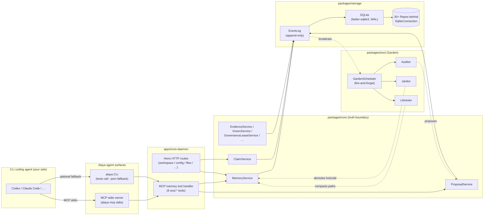
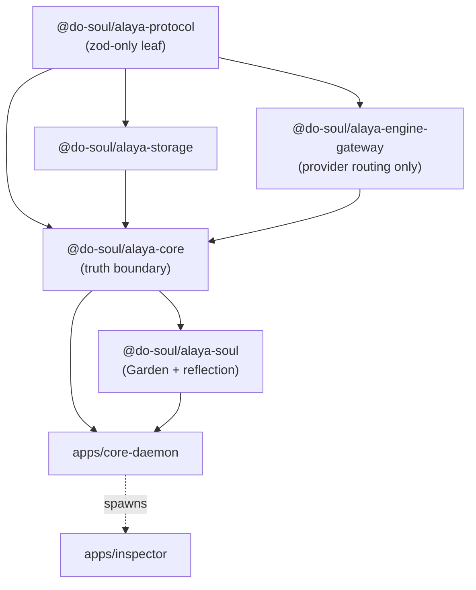

<div align="right">

**English** | [简体中文](README.zh-CN.md)

</div>

<div align="center">

# Do-SOUL Alaya

### *The local-first memory plane for CLI coding agents.*

Codex, Claude Code, or any MCP-compatible agent attach over MCP and get
durable, evidence-backed memory across sessions. No chat UI. No telemetry.
No cloud. Just a SQLite file you own.

[](#status--roadmap)
[](LICENSE)
[](#status--roadmap)
[](#quickstart)
[](#quickstart)
[](#architecture)
[](#architecture)
[](#mcp-tool-surface)

[**Quickstart**](#quickstart) ·
[**What it is**](#what-alaya-is) ·
[**vs alternatives**](#alaya-vs-alternatives) ·
[**Architecture**](#architecture) ·
[**Roadmap**](#status--roadmap)

</div>

---

> **The problem.** A CLI coding agent forgets everything when the session
> ends. Two agents on the same project don't share what they learned.
> Pasting context manually scales to roughly one project before it stops
> working.
>
> **What Alaya does.** It runs next to your agent as a *memory plane*:
> durable capsules with evidence, governance gates, recall over multiple
> paths, and a Garden of background roles that audits and compacts memory
> while you work. The agent proposes; Alaya decides what becomes truth.

This repository is a **port** of the memory subsystem from the sibling
project [`do-what-new`](https://github.com/tdwhere123) — frozen at
`vendor/do-what-new-snapshot/`. v0.1.0 is the first release where the
ported subsystem is wired end-to-end and exposed through CLI + MCP.

---

## Why Alaya

- **Local-first by design.** A single SQLite file on your disk, in a format
  `sqlite3` opens. No SaaS, no auth dance, no cloud round-trip on the recall
  path.
- **Evidence-gated, not embedding-gated.** Durable memory needs a source.
  Embedding is a recall *supplement*, never a truth oracle — if it disagrees
  with evidence, evidence wins.
- **Agent proposes, Alaya decides.** The LLM emits *candidates*; governance
  (Promotion Gate, HITL when needed) decides what becomes durable. There is
  no path that lets the agent silently overwrite truth.
- **MCP and CLI, not GUI.** 8 `soul.*` MCP tools and 11 CLI verbs over the
  same runtime. Attach over MCP, script over CLI, audit everything in
  between.
- **Test coverage that is actually load-bearing.** 1917 tests across 248
  files. Every fix in the v0.1.0 system review went through atomic
  re-review before merging.
- **Port-first, not vibe-rewrite.** The hard parts — governance, EventLog,
  Garden, recall — are ported byte-for-byte from a memory subsystem that
  has been hardening upstream for cycles. We did not re-derive what
  already worked.

---

## Alaya vs alternatives

|  | Alaya | Vector DB (chroma / qdrant / pgvector) | RAG framework (langchain / llamaindex memory) | Chat history / context files |
|---|---|---|---|---|
| Truth model | Evidence-gated, governed | Similarity-only | Pipeline-defined | Flat — no model |
| Who decides what is durable | Governance gate | Whoever writes the index | Whoever calls `.add()` | Whoever last edited the file |
| Cross-session continuity | Yes (EventLog + capsules) | Depends on caller | Depends on caller | Manual paste |
| Agent integration | MCP stdio + CLI | Library SDKs | Library SDKs | None |
| Auditability | EventLog + per-mutation audit | Index logs (varies) | Tracing (varies) | `git log`, if you commit them |
| Storage | SQLite (one file you own) | Server / managed cluster | Pluggable (often hosted) | Plain files |
| GUI dependency | None — no chat UI | Optional dashboard | Often a notebook / app | None |
| Learning curve | High invariants, low ops | Low invariants, low ops | Medium invariants, varies | Zero |

Alaya is the right tool when you want **durable, defended memory** for an
agent — not when you want fast similarity search over documents. Use a
vector DB for the latter; you can compose the two.

---

## Table of contents

- [Why Alaya](#why-alaya)
- [Alaya vs alternatives](#alaya-vs-alternatives)
- [What Alaya is](#what-alaya-is)
- [What Alaya is *not*](#what-alaya-is-not)
- [Audience](#audience)
- [Why local-first](#why-local-first)
- [Architecture](#architecture)
- [MCP tool surface](#mcp-tool-surface)
- [CLI commands](#cli-commands)
- [Quickstart](#quickstart)
- [Project layout](#project-layout)
- [Status & roadmap](#status--roadmap)
- [How this codebase came to be](#how-this-codebase-came-to-be)
- [Contributing](#contributing)
- [Acknowledgments](#acknowledgments)
- [License](#license)

---

## What Alaya is

A *memory plane* that sits next to a CLI coding agent and owns its
long-lived memory: project facts, decisions, evidence, the relationships
between objects. Two ideas drive every design choice.

**Truth versus view.** Memory ontology is durable truth. Anything you can
query — recall results, projections, the Memory Inspector view — is a
view, not truth. Views can drift and be wrong; the underlying capsule is
what anyone has to defend.

**Agent proposes; Alaya decides.** The connected agent (LLM) emits
*candidates*: "this fact should be remembered", "this evidence updates
that capsule". Candidates enter governance — Promotion Gate, HITL when
needed — and only become durable memory after the gate accepts them.
There is no "auto-write whatever the agent said" path.

What ships in v0.1.0:

- An **evidence-backed memory ontology** — `MemoryEntry`, `EvidenceCapsule`,
  `SynthesisCapsule`, `ClaimForm` — gated for durable truth.
- **Multi-path recall** — lexical, FTS, path-aware, embedding (optional
  supplement).
- **Governed promotion** — Promotion Gate, HITL, Green status state machine.
- **Session trust** — the *delivered ≠ used* invariant tracked end-to-end.
- **Garden self-maintenance** — Auditor / Janitor / Librarian + Scheduler,
  fire-and-forget.
- **Profile, secret, import / export, portable backup** operations.
- An **MCP server** (`alaya mcp stdio`) exposing 8 `soul.*` tools, with a
  CLI fallback for the same surface.
- A **Memory Inspector** SPA (`alaya inspect`) for memory tooling — *not*
  an agent surface.

## What Alaya is *not*

Stated bluntly so you can decide quickly whether Alaya fits.

- **Not a chat product.** You don't talk to Alaya. The agent does.
- **Not a conversation TUI.** No prompt loop, no history viewer.
- **Not a vector database.** Embedding is a recall supplement; it never
  decides durable truth. Evidence wins.
- **Not an agent autopilot.** Alaya never runs the agent, never generates
  code, never speaks to a model on its own. Garden is bounded background
  maintenance, not autonomous reasoning.
- **Not for end users.** See the next section.

## Audience

Alaya is built for **engineers running a CLI coding agent**:

- You drive Codex, Claude Code, or a similar agent from a terminal.
- You write code or operate a system where the agent's memory across
  sessions is a real bottleneck.
- You're comfortable with `pnpm`, Node 20+, SQLite, MCP transport.

Per project invariant §21a (`docs/handbook/invariants.md`):

> Public-facing copy (README, marketing surfaces, leaderboard disclosure,
> blog posts) must describe Alaya as a memory plane for CLI agents
> (Codex / Claude Code / similar) and must not invite non-engineering
> users to install or operate Alaya.

If a non-engineer in your life is asking about Alaya, the right answer is
"this is not for you yet" — not a workaround. A separate consumer-facing
product, or a charter amendment, is required before that audience.

## Why local-first

The memory plane is one SQLite file (WAL-mode, busy-timeout tuned, ~57
ordered migrations).

- **You own the data.** It is on your disk, in a format you can open with
  `sqlite3` and inspect by hand. No SaaS lock-in.
- **It works offline.** Recall, propose, and governance need no network.
  The optional embedding supplement is configurable and off by default in
  v0.1.0.
- **It is portable.** `alaya backup` / `export` / `import` produce signed
  bundles you can move between machines.
- **It is auditable.** Governance, configuration, import / export, backup,
  and session-trust changes all write to the EventLog — append-only,
  the source of truth for state replay.

## Architecture

### Runtime data flow



The daemon is the only place writes happen. Agents never touch the
database directly; they go through MCP / CLI → daemon → service →
EventLog → DB. Garden roles read EventLog projections and emit new
proposals (e.g. evidence staleness audit) — they never bypass the
governance path.

### Package dependency direction



Rules enforced by tests in CI:

- `@do-soul/alaya-protocol` depends only on `zod`. It is the leaf.
- All domain types come from `@do-soul/alaya-protocol` — no parallel type
  definitions in core, storage, or daemon.
- `core` is the truth boundary; storage is mechanical persistence behind
  it; storage does not decide truth.
- State transitions follow **EventLog → DB update → broadcast**, never
  DB-first.
- Garden runs fire-and-forget relative to the request path. Slow Garden
  work cannot block recall.

### SOUL three-layer model

| Layer | Purpose | Key objects |
|---|---|---|
| Memory Ontology | What is remembered long-term | `EvidenceCapsule`, `MemoryEntry`, `SynthesisCapsule`, `ClaimForm` |
| Structure Registry | How objects are located and bound | `PathRelation`, `ActivationCandidate`, `ManifestationDecision` |
| Runtime Control Plane | How memory is assembled per turn | `RecallQuery`, `ContextPack`, `TrustSummary` |

## MCP tool surface

Eight tools, all schema-bounded — `maxLength`, `maxItems`,
`additionalProperties: false` are derived from the zod request schemas
and enforced both at parse time and in the published catalog.

| Tool | Purpose | Mutating? |
|---|---|---|
| `soul.recall` | Hybrid recall: lexical + FTS + path-aware + (optional) embedding supplement | no |
| `soul.open_pointer` | Read a memory object by id, public projection only | no |
| `soul.explore_graph` | Walk neighbours of a memory node by edge type / direction; workspace bound from MCP context | no |
| `soul.emit_candidate_signal` | Submit a candidate signal — the agent's "I think this matters" | yes (proposal-side) |
| `soul.propose_memory_update` | Propose a typed mutation to a memory entry | yes (proposal-side) |
| `soul.review_memory_proposal` | Resolve a proposal: accept or reject (HITL or governance role) | yes |
| `soul.apply_override` | Session-scoped override on a target object | yes (session-scope) |
| `soul.report_context_usage` | Close the loop on a recall delivery: used / skipped / not_applicable | yes (audit) |

Proposing or applying an override never modifies durable memory by
itself — it goes through the governance path (Promotion Gate / HITL).
Recall and graph exploration are read-only.

`alaya tools list --json` and `alaya tools call <tool> '<json>' --json`
are the CLI fallback for the same surface, useful for scripting outside
the agent runtime.

## CLI commands

Eleven verbs in total. All require a prior `pnpm build`.

| Command | Purpose | Mutating? | Audit log? |
|---|---|---|---|
| `alaya doctor` | Diagnose env, storage health, schema version, daemon reachability | no | no |
| `alaya install` | Plan / apply / rollback an install profile (db path, embedding, engine binding) | yes | yes |
| `alaya attach codex` | Add `mcpServers.alaya` to `~/.codex/config.toml` (preview → confirm → apply) | yes | yes |
| `alaya attach claude-code` | Add `mcpServers.alaya` to `~/.claude.json` (preview → confirm → apply) | yes | yes |
| `alaya detach codex` / `detach claude-code` | Reverse the corresponding attach atomically | yes | yes |
| `alaya status` | Daemon health and trust-state summary | no | no |
| `alaya inspect` | Open the Memory Inspector SPA on loopback (memory-tooling surface) | no | no |
| `alaya tools list` | List MCP tool catalog (CLI fallback for `tools/list`) | no | no |
| `alaya tools call <tool> '<json>'` | Invoke a tool from CLI; useful for scripts and CI | varies | varies |
| `alaya backup --output <path>` | Portable backup bundle (signed) | no | yes |
| `alaya export --output <path>` / `import --bundle <path>` | Portable export / restore | export: no, import: yes | yes |
| `alaya mcp stdio` | Run the daemon's MCP stdio server (this is what `attach` wires up) | no | no |

Every mutating verb supports preview before write. `attach` and `detach`
are atomic. The audit log lives at `~/.config/alaya/audit/`, so you can
always retrace what changed and when.

## Quickstart

You don't need anything beyond `git`, Node 20+, and pnpm 9+. The `rtk`
references in `CLAUDE.md` are a Claude Code optimisation; bare `pnpm`
works the same.

```bash
# 1) Clone
git clone https://github.com/tdwhere123/Do-SOUL-Alaya.git
cd Do-SOUL-Alaya

# 2) Verify host requirements
node --version    # >= 20.19.0
pnpm --version    # >= 9

# 3) Install workspace dependencies
pnpm install

# 4) Build (compiles every package; produces apps/core-daemon/dist/)
pnpm build

# 5) Doctor — verifies env, storage schema_ok, and daemon reachability
pnpm alaya doctor
#   Expect: checks.environment = ok, storage.schema_ok = true (when configured).
#   On a fresh clone, garden status reads `degraded` until the daemon is up
#   (the agent starts it via attach); doctor exits 75 in that case. That is
#   advisory, not a hard failure.

# 6) Install profile — creates alaya.db at the path you pass and writes audit log
pnpm alaya install --non-interactive '{"db_path":"./alaya.db","embedding_enabled":false}'
#   Skip this step if you already have a config in ~/.config/alaya/.

# 7) Attach to your agent — writes ~/.claude.json (or ~/.codex/config.toml)
pnpm alaya attach claude-code      # preview, confirm, then apply
#   Use `pnpm alaya detach claude-code` at any time to undo cleanly.

# 8) First tool call — verify the MCP surface end-to-end
pnpm alaya tools list --json | jq '.tools | length'
#   Expect: 8

pnpm alaya tools call soul.recall \
  '{"query":"hello","scope_class":null,"dimension":null,"domain_tags":null,"max_results":5}' \
  --json
#   Expect: { "delivery_id": "...", "results": [...], "total_count": <int> }
```

After step 7 your agent sees Alaya as an MCP server on its next start,
and the 8 `soul.*` tools become callable from inside the agent.

**If a step fails:**

- `pnpm alaya doctor` tells you which check failed (env, storage, daemon,
  mcp transport). It is the first place to look.
- `pnpm alaya install --plan-only '<json>'` shows the diff before apply.
- `pnpm alaya detach codex` (or `claude-code`) atomically reverses the
  attach and writes its own audit entry.
- Storage problems leave `alaya.db.shm` / `alaya.db.wal` files — that is
  WAL working state, not corruption. `alaya doctor` warns when the
  schema version diverges.

## Project layout

```
Do-SOUL Alaya/
├── apps/
│   ├── core-daemon/             Hono HTTP + MCP stdio + CLI entry
│   └── inspector/               Memory Inspector SPA (loopback memory-tooling, NOT an agent surface)
├── packages/
│   ├── alaya-protocol/          zod schemas (truth boundary leaf)
│   ├── alaya-storage/           SQLite + ~57 ordered migrations
│   ├── alaya-core/              services (memory / proposal / claim / evidence / green / ...)
│   ├── alaya-soul/              Garden roles + reflection
│   └── alaya-engine-gateway/    provider routing (no business logic)
├── docs/
│   ├── handbook/                dev navigation hub
│   │   ├── README.md
│   │   ├── invariants.md
│   │   ├── port-protocol.md
│   │   ├── code-map.md
│   │   ├── runtime-status.md
│   │   ├── backlog.md
│   │   └── workflow/            agent-workflow / review-protocol / subagent-dispatch
│   └── v0.1/                    port task cards (INDEX.md is the entry)
├── vendor/
│   └── do-what-new-snapshot/    frozen upstream source (port-first reference)
├── bin/alaya.mjs                CLI shim (used by `pnpm alaya …`)
├── README.md / README.zh-CN.md
├── CLAUDE.md                    instructions for the agent contributor
└── LICENSE
```

## Status & roadmap

This section is honest about what is and isn't done. Prefer the table
below to any "production-ready" badge.

### v0.1.0 — Released

- HEAD `ac87e16`, released 2026-05-03.
- Gate-5 closed; **p5-system-review** converged after 3 rounds (~37
  atomic fix-commits).
- 248 test files, **1917 tests passing**.
- 11 CLI subcommands all wired.
- 8 `soul.*` MCP tools all wired.
- **Open backlog: 0.**
- Defense invariants added: §21a (audience), §29 (Default Scope), §30
  (Fix at Source), §31 (Single-Source Concurrency).

### v0.1.1 — Planned (Phase 6 marketing benchmark wave)

Five task cards, all currently `not-started`:

- `bench-adapter` — provider adapter to a user-chosen OpenRouter model.
- `bench-harness` — evaluation framework.
- `bench-baselines` — baseline comparisons.
- `bench-resume` — resume mechanism.
- `bench-readme` — leaderboard template (this README will gain real
  numbers here).

The `#BL-017` hygiene wave has executed after Gate-5: protocol
`phase-*.ts` event files and symbols now use domain names, the eight
listed oversized production files were split, unused-code checking is
reproducible through pinned `knip`, and the code map was refreshed.

**There is no leaderboard yet.** This README will not display benchmark
numbers until v0.1.1 lands.

### v0.2 — Deferred (with explicit close conditions)

| Issue | What's deferred | Close condition |
|---|---|---|
| `#BL-008` | `pi-mono` integration (replaces upstream `provider/ai-sdk-*.ts` routing) | v0.2 routes synthesis / proposal scoring / reflection through `pi-mono`. |
| `#BL-009` | OS keychain support | macOS Keychain / Linux libsecret / Windows Credential Manager adapter; `secret-ref` syntax extends to `keychain:<service>:<account>`. |
| `#BL-022` | EventPublisher atomicity + EventLog revision transaction | New `EventPublisherEventLogRepoPort.appendManyWithMutation` (sync mutate inside a single `connection.transaction()`); EventLog revision computed inside the transaction; ~12 callers migrated. |

Until then, `#BL-022` is mitigated by SQLite CAS and the
`unique(entity_type, entity_id, revision)` index from migration 028,
plus the registered divergence in invariants §"EventPublisher mutation
audit-id divergence" (`#BL-021`).

## How this codebase came to be

Alaya is a **port** of the memory subsystem of `do-what-new`, **not a
clean-room rewrite**. This is intentional and worth understanding before
you read the code.

The frozen upstream snapshot lives at `vendor/do-what-new-snapshot/` —
see `vendor/do-what-new-snapshot/SNAPSHOT_REF.md` for the source commit
hash and stability assurance.

The discipline (`docs/handbook/port-protocol.md`):

- **trivial-copy** (default): copy file as-is, change package name and
  import paths only.
- **adapt-and-port** (limited): allowed when the target interface
  differs (e.g. `SqliteConnection` injection); every adapter point is
  listed in the task card.
- **requires-redesign** (rare): default-prohibited; needs explicit user
  approval and a Charter Authority cite.

**Why port-first instead of rewrite:**

- The upstream subsystem has been hardened across release cycles inside
  `do-what-new`. Re-deriving its decisions from scratch would have cost
  months of latent-bug rediscovery.
- The Alaya-specific surfaces (CLI, install / attach / detach, doctor,
  Memory Inspector, profile / audit) *are* greenfield — they wrap the
  ported core, they do not replace it.

**The tradeoff, stated honestly:**

- Some upstream tech-debt rode along for the v0.1.0 release, especially
  misleading `phase-*.ts` event names and oversized port files. `#BL-017`
  closed that debt in the post-port hygiene wave without changing
  durable contracts.
- We chose velocity over local optimality at v0.1. The first day a
  refactor made sense was Gate-5 close, when the `#BL-017` wave could
  execute against a stable release baseline.

## Contributing

PRs from outside contributors are welcome but must respect Port-First
discipline. Specifically:

1. Read the entry docs in this order:
   `docs/handbook/README.md` → `docs/handbook/invariants.md` →
   `docs/handbook/port-protocol.md` → `docs/v0.1/INDEX.md` → the task
   card you intend to take.
2. For changes inside `packages/*` or `apps/core-daemon/src/`, your PR
   must show the file logic matches `vendor/do-what-new-snapshot/<src>`
   byte-for-byte (trivial-copy) or list every adapter point
   (adapt-and-port).
3. Don't write a "better" reimplementation of an existing
   `vendor/do-what-new-snapshot/` file. That kind of PR will be declined
   regardless of code quality.
4. `pnpm build` and `pnpm test` must both pass; the Review Protocol
   checklist (`docs/handbook/workflow/review-protocol.md`) must report
   zero Blocking / Important findings.

For Alaya-original surfaces (CLI, install / attach / detach, Memory
Inspector frontend) the path is different — those are
`requires-redesign` cards. See invariant §24.

## Acknowledgments

- [`do-what-new`](https://github.com/tdwhere123) — upstream project; the
  memory subsystem here is its port.
- [`better-sqlite3`](https://github.com/WiseLibs/better-sqlite3) — local
  SQLite driver.
- [`Hono`](https://hono.dev) — HTTP framework for the daemon.
- [`zod`](https://zod.dev) and
  [`zod-to-json-schema`](https://github.com/StefanTerdell/zod-to-json-schema)
  — single source of truth for the public MCP catalog.
- [`Vitest`](https://vitest.dev), [`pnpm`](https://pnpm.io),
  [`tsup`](https://tsup.egoist.dev), and the Model Context Protocol spec.

## License

[MIT](LICENSE) © 2026 Do-SOUL Alaya contributors
