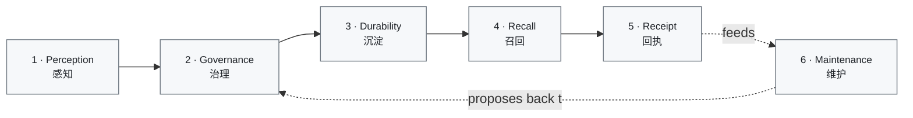

<div align="right">

**English** | [简体中文](README.zh-CN.md)

</div>

<div align="center">

# Do-SOUL Alaya

### *A local-first memory plane for CLI coding agents.*

[](#where-this-is-going)
[](LICENSE)
[](#where-this-is-going)
[](#quickstart)
[](#quickstart)
[](#architecture-at-a-glance)
[](#architecture-at-a-glance)
[](#surfaces-mcp--cli)

[**The problem**](#the-problem) ·
[**Design grammar**](#how-i-think-about-memory) ·
[**Memory's lifecycle**](#memorys-lifecycle) ·
[**Architecture**](#architecture-at-a-glance) ·
[**Quickstart**](#quickstart) ·
[**Roadmap**](#where-this-is-going)

</div>

---

## The problem

A CLI coding agent's memory is a session: it forgets when the
terminal closes. Two agents on the same project don't share what
they learned. Pasting context manually scales to about one project
before it stops working.

You can patch this with a vector database, but a vector DB answers
*"what's similar to this string"* — not *"what is true about this
project"*. Similarity is not truth. Embedding is not evidence. A
recall that ranks by cosine distance can be fluent, confident, and
wrong, and the agent will follow it.

Memory is not a single problem. It has phases — **perception,
governance, durability, recall, receipt, maintenance** — and each
phase has its own failure mode. If perception writes durable, the
agent can hallucinate truth in. If recall trusts embedding over
evidence, similarity defeats fact. If maintenance touches durable
directly, audit dies. **Alaya is the discipline applied to each
phase separately, with one source-of-truth invariant tying them
together.**

It runs next to your agent — over MCP for attach, over a CLI for
scripting — and stores everything in one SQLite file you own. No
chat UI. No telemetry. No cloud round-trip on the recall path.

---

## Where Alaya sits

Two questions a CLI-agent memory system has to answer, and they trade
against each other:

1. **Recall axis** — given a question, can you surface the right turn?
2. **Governance axis** — when a candidate becomes a durable claim, who
   approved it, what evidence supports it, who could it conflict with,
   and is that decision auditable?

Most public memory frameworks (`mem0`, `agentmemory`, `Letta`, …) optimise
hard on axis 1 and stay light on axis 2. Alaya inverts that emphasis —
deliberately. The Quickstart and the Architecture sections below are
governance-first; recall accuracy is something we measure and publish as
the [bench-history](docs/bench-history/) archive, not something we
brand on.

The first honest LongMemEval-S retrieval baseline (v0.3.6, **full set
500/500 questions**, SQLite FTS + activation only, no embedding
supplement, 98% distractor session ratio per question, 2-shard
parallel via `apps/bench-runner/scripts/run-full-public-bench.sh`):

| Axis | Alaya v0.3.6 | Why this is the framing |
|---|---|---|
| Retrieval R@5 (LongMemEval-S full set n=500) | **60.2%** | FTS + activation, no embedding. v0.3.7 will wire the real embedding provider; this number is the floor, not the ceiling. (Shard split: 52.0% on the first 250 human-authored questions, 68.4% on the last 250 GPT-4-augmented questions — the asymmetry is dataset, not stack.) |
| Retrieval R@1 / R@10 / p95 latency | 45.8% / 60.6% / 73ms (≤ upper bound across 2 shards) | Same 500-q run. Latency is in-process daemon, not over a network. R@10 − R@5 = 0.4 pp means rank 6–10 added only **2 hits out of 500** in this run — could be top-5 concentration, could be FTS-without-embedding lacking ranking granularity past top-5. Until per-row `hit_at_10` / `first_hit_rank` is tracked (v0.3.7), do not read this as a ranking-quality claim. |
| Governance — durable proposals require accepted review | ✅ HITL gate | `soul.propose_memory_update` → `soul.review_memory_proposal` (accept/reject). Rejection does not mutate truth. |
| Audit completeness — every durable mutation is a SOUL_* event | ✅ 9+ event-types per propose+review chain | EventLog row per signal / proposal / review / resolution / memory update. Recoverable by `apps/bench-runner/scripts/audit-trail-witness.mjs`. |
| Conflict & tier discipline | ✅ Tier-aware promotion + path plasticity | Recall returns tier-stamped pointers (hot/warm/cold) + degradation reason; see `Recall` Inspector page. |
| Local-first storage | ✅ Single SQLite WAL file | No network on recall path. Backup / export / import are 13-verb CLI commands. |

For the contrast: `agentmemory`'s public README cites R@5 = 95.2% on
LoCoMo, token-saved 92%, annual cost ~$10. Different dataset, different
stack — quoted "as reported, link" so the reader can verify. We do not
have a directly comparable number on LoCoMo today; that is a v0.3.7
follow-up. What we *do* have is the v0.3.6 bench-history archive, every
KPI reproducible by:

```bash
# self-bench (8 inline synthetic scenarios, ~10s)
node apps/bench-runner/bin/alaya-bench-runner.mjs self
# LongMemEval-S full 500-q set, 2-shard parallel (~85 min on a typical
# laptop; sequential is ~150 min). Writes a single merged kpi.json +
# report.md to docs/bench-history/public/<slug>/.
apps/bench-runner/scripts/run-full-public-bench.sh --variant s --shards 2
```

(see [release-notes](docs/v0.3/v0.3.6/release-notes.md) for the full
command list and threshold-gated regression contract.)

The shape of the bet: an attached coding agent is fine with R@5 ≈ 60%
as long as the durable claims it acts on are audited and reversible.
A naked R@5 = 95% number is worth less than a 60% number whose decisions
you can trace to the evidence that produced them.

---

## How I think about memory

Two coordinates organise the whole system. They are the design
grammar — every section below refers back to them.

**Three layers** — what the runtime actually moves through:

| Layer | What lives here | Examples |
|---|---|---|
| **Memory Ontology** | Durable semantic truth | `EvidenceCapsule`, `MemoryEntry`, `SynthesisCapsule`, `ClaimForm` |
| **Structure Registry** | Routing, binding, arbitration, visibility | `PathRelation`, `ConflictMatrix`, `ManifestationDecision` |
| **Runtime Control** | Per-turn assembly, gates, projection | `RecallQuery`, `ActivationCandidate`, `ContextPack`, `TrustSummary` |

**Four axes** — where truth lives:

- **Object** — *what* is remembered (faceted stable units; time, situation, risk, obligation are *facets* of objects, not external labels).
- **Path** — learnable conditional relations between objects. *Recall, prediction, and reminder are runtime manifestations of paths, not independent subsystems.*
- **Evidence** — what supports a claim and how that support decays (object evidence + path plasticity: reinforcement, weakening, redirection, retirement).
- **Governance** — who wins, what conflicts, what needs review, what becomes stale; also the maximum effect a learned path may exert in a single turn.

**The single invariant that keeps memory from rotting:**

> An object, index, or state is source-of-truth on **exactly one** axis.
> Other axes may reference it, but never silently replace it.

This is the rule that lets recall (Path axis) reach into evidence
(Evidence axis) and ontology (Object axis) without quietly mutating
either. Every phase below honours it explicitly — and the places
where v0.1 doesn't yet honour it as cleanly as it could are called
out in the [Roadmap](#where-this-is-going).

---

## Memory's lifecycle

Six phases. Each phase is an answer to a specific failure mode I've
seen in agent-memory systems that ignore the design grammar above.



Read the diagram as: an agent perceives → governance decides → the
decision lands durably → later turns recall it → the agent reports
whether the recall was used → maintenance audits, compacts, and
proposes corrections back through governance. Nothing skips
governance to write durable.

### 1. Perception (感知)

**What happens.** A *candidate signal* — *"I think this matters"* —
enters one of two ways. The agent can emit one explicitly via
`soul.emit_candidate_signal`. But it doesn't have to: the daemon also
extracts signals server-side from the turn text the agent already
forwards on `soul.recall` (`recent_turn`) and
`soul.report_context_usage` (`turn_digest`), so a fresh install starts
learning from the first conversation without the agent filing anything.
Either way the signal is persisted (so it survives the turn) but does
**not** mutate ontology truth. A triage step decides: low confidence +
no evidence → deferred; otherwise → may flow into the proposal pipeline.

The built-in extractor (`LocalHeuristics`) is deliberately conservative
— pattern matching for forms like *"I always use X"* / *"we decided …"*
in English and Chinese, plus Chinese self-introduction (*"请叫我 …"*) —
so it catches the obvious durable facts and misses nuanced ones;
pointing Garden compute at an `official_api` model widens that. The
explicit `soul.emit_candidate_signal` channel stays available for facts
the agent judges worth recording that the heuristics won't see.

**Garden compute mode** is one of three: `local_heuristics` (the
default — no external calls), `official_api` (an OpenAI-compatible
model), or `host_worker` (the attached CLI agent itself drains the
extract queue via `garden.list_pending_tasks` / `garden.claim_task` /
`garden.complete_task`). The default is inferred from whether a Garden
credential is configured; to pick it explicitly — `host_worker` in
particular can't be inferred — set `ALAYA_GARDEN_PROVIDER_KIND` in
`~/.config/alaya/.env` or pass `garden_provider_kind` to `alaya install
--non-interactive` for a fresh setup, or use the Garden Compute form in
`alaya inspect --open` (which writes the persisted runtime config and,
once saved, takes precedence over the env default). `alaya doctor` prints
the live mode on its `garden compute:` line. The official-API endpoint
and model are the non-secret `OFFICIAL_API_GARDEN_PROVIDER_URL` /
`OFFICIAL_API_GARDEN_MODEL` (plain `.env` or the same Inspector form);
only the API key is a secret — store it with `alaya install --keychain`
(or `env:` / `file:` refs).

**Failure mode this prevents.** If the agent could write durable
truth at perception, every fluent-but-wrong assertion would become
fact. The model's confidence would become the truth model.

**Design choice.** Signal is candidate input, not proposal or fact.
Triage at the boundary, not at recall. The signal record is durable on the
**Runtime Control** layer; ontology truth (Memory Ontology layer,
Object / Evidence axes) is untouched until later phases say so.

*Code anchors:* `packages/core/src/signal-service.ts:80-130`,
`packages/core/src/signal-service.ts:270-283` (the triage gate).

### 2. Governance (治理)

**What happens.** Governance has two reviewer-bound routes; both end
in the same EventLog audit shape, and Garden's only legal `ClaimForm`
output is `claim_status = draft` either way.

- **Inline typed resolution** via `soul.resolve`. Recall results
  carry an optional `staged_warnings[]` for draft claims that need
  attention; the agent picks one of six resolutions (`confirm` /
  `reject` / `correct` / `stale` / `defer` / `not_relevant`) and the
  daemon atomically transitions `draft → active` (or terminates the
  draft, or writes a `DeferredObligation`, etc.) with a typed
  `soul.resolution.*_applied` audit row.
- **Out-of-band Proposal** via `soul.propose_memory_update` plus
  `soul.review_memory_proposal`. Triaged signals become `Proposal`s
  with `resolution_state: PENDING`; a reviewer accepts or rejects
  with explicit `reviewer_identity`. Acceptance applies the accepted
  `proposed_changes` through the controlled durable memory service
  and leaves a proposal audit trail. Reject leaves durable memory
  untouched.

The Memory Inspector is the **origination surface** for human
review actions, never a persistence surface — the "Promote to
strictly_governed" button posts a typed `path_relation` Proposal that
re-enters the governance gate; it never writes durable directly.

**Failure mode this prevents.** *"The agent said so"* is not a
governance argument. Without an explicit reviewer-bound resolution,
every patch becomes a silent merge. Pushing all promotion through
typed resolutions also closes the "producer-side high-confidence
auto-active" loophole that turns syntactic evidence-ref presence
into pretend verification.

**Design choice.** Propose / review and `soul.resolve` are separate
verbs on the **Governance axis**. Promotion bookkeeping (Claim
lifecycle, karma) lives on the **Memory Ontology** layer and
**Object** axis but only changes through one of the two routes
above.

*Code anchors:*
`apps/core-daemon/src/mcp-memory-proposal-workflow.ts`,
`apps/core-daemon/src/mcp-memory-resolve-handler.ts`,
`packages/core/src/resolution-service.ts`,
`packages/core/src/memory-service.ts`,
`packages/storage/src/migrations/063-proposal-memory-update-patch.sql`.

### 3. Durability (沉淀)

**What happens.** When governance accepts, the change goes through a
fixed pipeline: **EventLog append → DB mutation → in-process notify**.
EventLog is append-only and is the audit-of-record. The DB is the
queryable projection of the EventLog. Notify is in-process fan-out
to background listeners (Garden, etc.) — *not* SSE, *not* a network
broadcast.

**Failure mode this prevents.** DB-first writes mean the audit log
chases the database — and the gap between them is exactly where
untraceable state slips in. EventLog-first means *audit precedes
broadcast*: no listener ever sees a state the EventLog cannot
replay.

**Design choice.** A single `EventPublisher.appendManyWithMutation()`
boundary. Durable writes always pair EventLog rows with the DB
mutation; consumers downstream subscribe to the notification, not to
the DB. Lives on the **Memory Ontology** layer (durable truth) plus
**Runtime Control** (the dispatch).

*Code anchors:* `packages/core/src/event-publisher.ts:40-62`,
`packages/storage/src/repos/event-log-repo.ts:69-118`.

### 4. Recall (召回)

**What happens.** `soul.recall` runs four strategies in a fixed
order:

1. **Coarse filter** — deterministic match (scope / dimension /
   domain tags) plus precomputed activation rank on HOT-tier
   memories.
2. **FTS supplement** — full-text search inside the filtered set.
3. **Fine assessment** — budget-aware ranking with a weighted score
   (`activation × base + relevance + graph support − budget penalty
   − conflict penalty`).
4. **Embedding supplement** — *additive boost only*, never
   override.

The agent receives a `delivery_id` plus result entries, pointers, and
stable explanation metadata: `selection_reason`, `source_channels`,
`score_factors`, `budget_state`, response-level `strategy_mix`, and an
optional `degradation_reason`. Internal plumbing (the full
`ContextPack` projection) stays inside Alaya.

**Failure mode this prevents.** The most seductive failure of any
agent-memory system is letting embedding decide truth. Cosine
distance is fluent and confident, and it is also inversion-shaped:
a similar phrasing of a *contradicting* fact still scores high.

**Design choice.** Embedding cannot override the lexical / FTS /
path ranking — it can only add a clamped, weighted boost
(similarity ∈ [0, 1], weight 0.8) on top of the base score. If the
embedding service is missing, misconfigured, or returns nothing,
recall falls back to lexical without raising. Recall lives on the
**Path axis** (recall *is* a runtime manifestation of paths) and
the **Runtime Control** layer.

*Code anchors:* `packages/core/src/recall-service.ts:189-315`
(orchestration), `packages/core/src/recall-service.ts:501-581` (the
embedding-supplement merge — proof the boost is additive, never
overriding).

### 5. Receipt (回执)

**What happens.** After a delivery, the agent reports
`used | skipped | not_applicable` via `soul.report_context_usage`.
Alaya appends a `MEMORY_USAGE_REPORTED` EventLog entry and stores a
`UsageProofRecord` linked to the original `delivery_id`. This feeds
the `TrustSummary` calculation that quantifies *delivered ≠ used*.

**Failure mode this prevents.** Without receipts, *delivered*
silently inflates into *useful*. Recall stats look great because
nothing is ever marked unused; the system congratulates itself on
work the agent ignored.

**Design choice.** Receipt is **advisory** (fire-and-forget) — the
agent can skip it, and Alaya degrades to a "delivered" trust state
without erroring. Lives on the **Evidence axis** as control-plane
evidence, **Runtime Control** layer.

*Code anchors:* `apps/core-daemon/src/trust-state.ts:147-187`,
`packages/protocol/src/soul/mcp-types.ts:146` (the three-state enum),
`packages/core/src/path-plasticity-service.ts` (Path-axis plasticity
fed by usage receipts).

### 6. Maintenance (维护)

**What happens.** Garden runs as a fire-and-forget background system
under the daemon/MCP process the user actually starts. In normal use,
`alaya attach <agent>` writes the profile, the agent launches
`alaya mcp stdio`, and that MCP process starts Garden, runs one startup
background pass, then keeps four periodic roles alive until the process
exits:

The default workspace is the directory that launched the CLI/MCP process.
`--workspace` and `ALAYA_WORKSPACE_ID` are explicit overrides; otherwise
Alaya registers the current directory as a stable local workspace so
recall, proposals, usage receipts, and Garden cleanup stay scoped to the
project you opened.

- **Auditor** — evidence staleness check, pointer health, orphan detection.
- **Janitor** — TTL cleanup, hot/warm tier demotion, dormant marking, tombstone GC.
- **Librarian** — merge detection, template clustering, neighbour discovery, path compression.
- **Scheduler** — owns the queue, tier prioritisation, cooling periods, task accounting.

**Failure mode this prevents.** A maintenance system that writes
durable directly bypasses governance. A maintenance system that
runs synchronously to recall destroys the recall budget the moment
the dataset grows. Garden does neither.

**Design choice.** Garden roles never write durable directly.
Janitor, Auditor, and Librarian call narrow maintenance ports that go
through EventLog-first publisher boundaries (`appendManyWithMutation`
or detached propagation for durable background repair), so the EventLog
remains the audit. Librarian also emits *proposals* back through
Governance — which is why the lifecycle diagram shows the dotted arrow
from Maintenance back to Governance, never to Durability. Garden is
*fire-and-forget* by invariant: if Garden is slow, recall is not slow
with it.

*Code anchors:* `packages/soul/src/garden/auditor.ts:62-89`,
`packages/soul/src/garden/janitor.ts:83-120`,
`packages/soul/src/garden/librarian.ts`,
`apps/core-daemon/src/garden-runtime.ts:98-111` (Scheduler EventLog wiring).

---

## Architecture at a glance

The packages map onto the design grammar — each one owns a specific
layer / axis combination, and the dependency direction prevents the
truth boundary from leaking.


Rules enforced by tests in CI:

- `packages/protocol` depends only on `zod` — it is the leaf; every
  other package consumes its types.
- `packages/core` is the truth boundary. Storage is mechanical
  persistence behind it; storage does not decide truth.
- State transitions follow **EventLog → DB update → notify**, never
  DB-first.
- Garden runs fire-and-forget; slow Garden work cannot block recall.
- `packages/engine-gateway` does provider routing only — no business
  logic, no path back into core.

---

## Surfaces: MCP + CLI

Two surfaces over one runtime. The agent attaches via MCP; humans
script via CLI. Both go through the same daemon and the same truth
boundary.

**MCP tools (10 `soul.*` + 3 `garden.*`)** — all schema-bounded
(`maxLength`, `maxItems`, `additionalProperties: false` derived from
the zod request schemas):

- **Recall** (read-only): `soul.recall`, `soul.open_pointer`,
  `soul.explore_graph`
- **Perception → Governance** (proposal-side writes):
  `soul.emit_candidate_signal`, `soul.propose_memory_update`,
  `soul.review_memory_proposal`, `soul.list_pending_proposals`
- **Inline typed resolution**: `soul.resolve` (six resolutions —
  `confirm` / `reject` / `correct` / `stale` / `defer` /
  `not_relevant` — for draft claims and staged warnings)
- **Runtime control & receipt**: `soul.apply_override` (session-scoped,
  never durable), `soul.report_context_usage` (audit-only write)
- **Garden host-worker** (when `provider_kind=host_worker`):
  `garden.list_pending_tasks`, `garden.claim_task`,
  `garden.complete_task`

`alaya tools list --json` prints the live MCP catalog (names +
descriptions + request schemas) and `alaya tools call <tool>
'<json>'` invokes any tool from CLI — both are scripting fallbacks
over the same daemon path. Run `alaya --help` for the full CLI
catalog of 13 verbs (doctor / install / attach / detach / status /
inspect / update / tools / review / backup / export / import / mcp
stdio); every mutating verb supports preview before write, attach
/ detach are atomic, and the audit log lives at
`~/.config/alaya/audit/`.

---

## Quickstart

### Option A — install from GitHub Releases (recommended)

> **Status:** Do-SOUL Alaya is **not published to npm**. v0.1.2 onward
> ships as a checksum-verified source tarball attached to each GitHub
> Release. The installer below downloads the tarball + `SHA256SUMS`,
> verifies the SHA256, then runs `pnpm install --frozen-lockfile && pnpm
> build` inside `~/.local/share/do-soul-alaya`. (No GPG / sigstore
> signing yet — tag protection on `v*` is the trust anchor.)

```bash
# Install a pinned release. The installer then downloads the matching
# release tarball, verifies SHA256SUMS, and builds locally.
ALAYA_VERSION=v0.3.9
INSTALLER="$(mktemp)"
trap 'rm -f "$INSTALLER"' EXIT
curl -fsSL -o "$INSTALLER" \
  "https://raw.githubusercontent.com/tdwhere123/Do-SOUL-Alaya/${ALAYA_VERSION}/scripts/install.sh"
ALAYA_VERSION="$ALAYA_VERSION" bash "$INSTALLER"

# Verify and attach.
alaya doctor

# Pass an absolute db_path — your shell expands ~ before alaya runs.
alaya install --non-interactive "$(printf '{"db_path":"%s/.config/alaya/alaya.db","embedding_enabled":false}' "$HOME")"
alaya attach claude-code
```

Pipe-to-bash shortcut (faster, but you execute the downloaded
installer directly; the release tarball is still checksum-verified by
the script):

```bash
curl -fsSL https://raw.githubusercontent.com/tdwhere123/Do-SOUL-Alaya/main/scripts/install.sh \
  | ALAYA_VERSION=v0.3.9 bash
```

Override install location:

```bash
curl -fsSL ... | ALAYA_HOME=/opt/alaya ALAYA_BIN_DIR=/usr/local/bin bash
```

Subsequent upgrades: rerun the `install.sh` one-liner with a newer
`ALAYA_VERSION`. The installer extracts and builds into a staging dir
first; only on success does it atomically swap into `$ALAYA_HOME`,
moving the previous install aside as `${ALAYA_HOME}.bak`. `alaya
update` is a read-only reminder for this GitHub Release / source-build
distribution path; it does not call npm or mutate the install.

Uninstall: `bash ~/.local/share/do-soul-alaya/scripts/uninstall.sh`
(add `--purge` to also remove `~/.config/alaya/`, which holds your
durable memory database and audit log).

### Option B — build from source

You need `git`, Node 20+, and pnpm 9+. The `rtk` references in
`CLAUDE.md` are a Claude Code optimisation; bare `pnpm` works the same.

```bash
# 1) Clone
git clone https://github.com/tdwhere123/Do-SOUL-Alaya.git
cd Do-SOUL-Alaya

# 2) Verify host requirements
node --version    # >= 20.19.0
pnpm --version    # >= 9

# 3) Install workspace dependencies
pnpm install

# 4) Build (compiles every package; produces apps/core-daemon/dist/)
pnpm build

# 5) Doctor — verifies env, storage schema_ok, and daemon reachability
pnpm alaya doctor
#   Expect: checks.environment = ok, storage.schema_ok = true (when configured).
#   On a fresh clone, garden status reads `degraded` until the daemon is up
#   or an attached agent has launched `alaya mcp stdio`; doctor exits 75 in
#   that case. That is advisory, not a hard failure.

# 6) Install profile — creates alaya.db at the path you pass and writes audit log
pnpm alaya install --non-interactive '{"db_path":"./alaya.db","embedding_enabled":false}'
#   Skip this step if you already have a config in ~/.config/alaya/.

# 7) Attach to your agent — writes ~/.claude.json (or ~/.codex/config.toml)
pnpm alaya attach claude-code      # preview, confirm, then apply
#   Use `pnpm alaya detach claude-code` at any time to undo cleanly.
#   On the next agent session, the MCP process starts Garden automatically.
#   If no ALAYA_WORKSPACE_ID is set, Alaya registers the agent's launch
#   directory as the current local workspace.

# 8) First tool call — verify the MCP surface end-to-end
pnpm alaya tools list --json | jq '.tools | length'
#   Expect: 13  (10 soul.* + 3 garden.* tools)

pnpm alaya tools call soul.recall \
  '{"query":"hello","scope_class":null,"dimension":null,"domain_tags":null,"max_results":5}' \
  --json
#   Expect: { "delivery_id": "...", "results": [...], "total_count": <int> }
#   Each result includes selection_reason/source_channels/score_factors/budget_state;
#   the response includes strategy_mix and optional degradation_reason.
#   v0.3.9 also adds an optional staged_warnings[] on each result that
#   the agent can resolve with soul.resolve.
```

After step 7 your agent sees Alaya as an MCP server on its next
start, and the 13 tools (10 `soul.*` + 3 `garden.*`) become callable
from inside the agent.

If a step fails, `pnpm alaya doctor` tells you which check failed
(version, env, storage, daemon, MCP transport) — it is the first
place to look. The full project layout is documented in
[docs/handbook/code-map.md](docs/handbook/code-map.md).

---

## Where this is going

### Current state (2026-05-17)

v0.3.9 is the current checkpoint; v0.3.4 was the first publicly
released v0.3.x line. Cumulative since v0.3.0: real Codex and Claude
Code MCP sessions autonomously run `soul.recall` →
`soul.report_context_usage` during normal conversations, with a
live-usage EventLog witness committed under `docs/v0.3/v0.3.0/`
(18 chains across both hosts after the v0.3.4 refresh).
`POST_TURN_EXTRACT` auto-captures from the `recent_turn` text the
host already forwards, so an empty store learns from the first
conversation without explicit `soul.emit_candidate_signal` calls.
v0.3.3 persists bounded `RECALLS` cross-link edges and later recall
reads them as weighted `graph_support`. v0.3.6 ships the bench
feedback loop and the Memory Inspector overview + recall pages.
v0.3.7 rebuilds the LongMemEval baselines after removing
question-shape heuristics. v0.3.8 reclaims the ontology mid-layer
(distilled `MemoryEntry.content`, `EvidenceCapsule` first-class with
its own FTS, four staged `MemoryGraphEdgeType` writers,
`PathRelationProposalService` on K=3 co-usage). **v0.3.9 closes the
three-layer trust loop**: Garden's only legal claim output is now
`claim_status = draft`; the new `soul.resolve` MCP verb owns the
typed promotion path; recall payloads carry an additive
`staged_warnings[]`; `PathRelation` evolves through stability /
governance classes and feeds `ManifestationResolver`; the Inspector
Health Inbox aggregates Auditor / OrphanRadar / Green into typed
operator actions; and `SynthesisCapsule.promotion` is retired now
that a replacement exists. The live MCP catalog is **13 tools** (10
`soul.*` + 3 `garden.*`).

`keychain:` secret refs are code-reviewed across Linux / macOS /
Windows adapters (runtime cross-platform write→read still deferred —
`env:` / `file:` refs are the runtime-verified path on WSL2); `alaya
doctor` prints the running daemon's `version` / `git_head` /
`built_at`. Distribution is GitHub-Release source tarball +
`SHA256SUMS`, verified locally by `scripts/install.sh`; npm publish
is intentionally out-of-scope.

### Where it is going

The arc past v0.1 is a *memory-centric agent* — one whose inner loop
is built around reading and writing memory rather than around chat.
Threads I'll pull next:

- **Trustworthy Memory Loop hardening** — keep the domain sequence
  explicit: recall delivery → usage receipt → candidate signal →
  proposal → accepted proposal → durable application → post-apply
  recall / usage proof. Make every link auditable from the daemon
  alone, no external tracing required. v0.2.x closed the cold-start
  gap — `soul.recall` now feeds server-side extraction so an empty
  store learns from the first conversation. v0.3.0 proves real-host
  recall/usage follow-through; what's left is richer extraction beyond
  `LocalHeuristics` and future proof, when available, that agents drive
  the *explicit* `emit`/`propose` channel autonomously.
- **Embedding strategy refinement** — keep "supplement, never
  oracle"; experiment with boost weight, supplement cap, per-domain
  calibration.
- **Recall budget shaping** — let the budget-penalty schedule reflect
  actual agent context-window cost rather than a static constant.
- **Provider boundary cleanup** — `packages/engine-gateway` becomes
  the only provider integration surface; core never imports a
  provider SDK directly.
- **Multi-agent shared memory** — two agents on the same project
  see the same governance queue, the same durable memory, and the
  same usage receipts without merging local state files.

Gaps and unfinished items live in `docs/handbook/backlog.md`; that
file is the source of truth, not this README.

---

## Contributing

PRs are welcome. Before opening one:

1. Read `docs/handbook/invariants.md` — the architecture
   non-negotiables (truth boundary, axes, EventLog ordering, Garden
   isolation).
2. Run `pnpm build` and `pnpm test` locally; both must be green.
3. For changes inside `packages/*` or `apps/core-daemon/src/`, keep
   the change surgical to the area named in your PR description.
   Don't refactor adjacent files in the same PR.
4. New behaviour needs at least one test that fails before your
   change and passes after.

For larger structural changes (a new MCP tool, a new Garden role, a
new axis interaction) — open an issue first to align on shape.

---

## Acknowledgments

- [`better-sqlite3`](https://github.com/WiseLibs/better-sqlite3) — local SQLite driver.
- [`Hono`](https://hono.dev) — HTTP framework for the daemon.
- [`zod`](https://zod.dev) and [`zod-to-json-schema`](https://github.com/StefanTerdell/zod-to-json-schema) — single source of truth for the public MCP catalog.
- [`Vitest`](https://vitest.dev), [`pnpm`](https://pnpm.io), [`tsup`](https://tsup.egoist.dev), and the Model Context Protocol spec.

---

## License

[MIT](LICENSE) © 2026 Do-SOUL Alaya contributors
