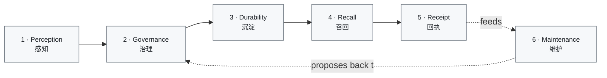
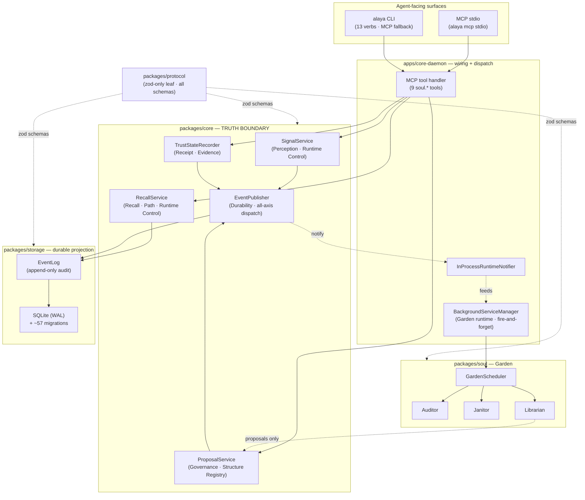

<div align="right">

**English** | [简体中文](README.zh-CN.md)

</div>

<div align="center">

# Do-SOUL Alaya

### *A local-first memory plane for CLI coding agents.*

[](#where-this-is-going)
[](LICENSE)
[](#where-this-is-going)
[](#quickstart)
[](#quickstart)
[](#architecture-at-a-glance)
[](#architecture-at-a-glance)
[](#surfaces-mcp--cli)

[**The problem**](#the-problem) ·
[**Design grammar**](#how-i-think-about-memory) ·
[**Memory's lifecycle**](#memorys-lifecycle) ·
[**Architecture**](#architecture-at-a-glance) ·
[**Quickstart**](#quickstart) ·
[**Roadmap**](#where-this-is-going)

</div>

---

## The problem

A CLI coding agent's memory is a session: it forgets when the
terminal closes. Two agents on the same project don't share what
they learned. Pasting context manually scales to about one project
before it stops working.

You can patch this with a vector database, but a vector DB answers
*"what's similar to this string"* — not *"what is true about this
project"*. Similarity is not truth. Embedding is not evidence. A
recall that ranks by cosine distance can be fluent, confident, and
wrong, and the agent will follow it.

Memory is not a single problem. It has phases — **perception,
governance, durability, recall, receipt, maintenance** — and each
phase has its own failure mode. If perception writes durable, the
agent can hallucinate truth in. If recall trusts embedding over
evidence, similarity defeats fact. If maintenance touches durable
directly, audit dies. **Alaya is the discipline applied to each
phase separately, with one source-of-truth invariant tying them
together.**

It runs next to your agent — over MCP for attach, over a CLI for
scripting — and stores everything in one SQLite file you own. No
chat UI. No telemetry. No cloud round-trip on the recall path.

---

## How I think about memory

Two coordinates organise the whole system. They are the design
grammar — every section below refers back to them.

**Three layers** — what the runtime actually moves through:

| Layer | What lives here | Examples |
|---|---|---|
| **Memory Ontology** | Durable semantic truth | `EvidenceCapsule`, `MemoryEntry`, `SynthesisCapsule`, `ClaimForm` |
| **Structure Registry** | Routing, binding, arbitration, visibility | `PathRelation`, `ConflictMatrix`, `ManifestationDecision` |
| **Runtime Control** | Per-turn assembly, gates, projection | `RecallQuery`, `ActivationCandidate`, `ContextPack`, `TrustSummary` |

**Four axes** — where truth lives:

- **Object** — *what* is remembered (faceted stable units; time, situation, risk, obligation are *facets* of objects, not external labels).
- **Path** — learnable conditional relations between objects. *Recall, prediction, and reminder are runtime manifestations of paths, not independent subsystems.*
- **Evidence** — what supports a claim and how that support decays (object evidence + path plasticity: reinforcement, weakening, redirection, retirement).
- **Governance** — who wins, what conflicts, what needs review, what becomes stale; also the maximum effect a learned path may exert in a single turn.

**The single invariant that keeps memory from rotting:**

> An object, index, or state is source-of-truth on **exactly one** axis.
> Other axes may reference it, but never silently replace it.

This is the rule that lets recall (Path axis) reach into evidence
(Evidence axis) and ontology (Object axis) without quietly mutating
either. Every phase below honours it explicitly — and the places
where v0.1 doesn't yet honour it as cleanly as it could are called
out in the [Roadmap](#where-this-is-going).

---

## Memory's lifecycle

Six phases. Each phase is an answer to a specific failure mode I've
seen in agent-memory systems that ignore the design grammar above.



Read the diagram as: an agent perceives → governance decides → the
decision lands durably → later turns recall it → the agent reports
whether the recall was used → maintenance audits, compacts, and
proposes corrections back through governance. Nothing skips
governance to write durable.

### 1. Perception (感知)

**What happens.** The agent emits a *candidate signal* — *"I think
this matters"* — via `soul.emit_candidate_signal`. The signal is
persisted (so it survives the turn) but does **not** mutate ontology
truth. A triage step decides: low confidence + no evidence →
deferred; otherwise → may flow into the proposal pipeline.

**Failure mode this prevents.** If the agent could write durable
truth at perception, every fluent-but-wrong assertion would become
fact. The model's confidence would become the truth model.

**Design choice.** Signal is proposal, not fact. Triage at the
boundary, not at recall. The signal record is durable on the
**Runtime Control** layer; ontology truth (Memory Ontology layer,
Object / Evidence axes) is untouched until later phases say so.

*Code anchors:* `packages/core/src/signal-service.ts:80-130`,
`packages/core/src/signal-service.ts:270-283` (the triage gate).

### 2. Governance (治理)

**What happens.** Triaged signals can become `Proposal`s with
`resolution_state: PENDING`. A reviewer (an agent that a human has
instructed to review, or a scripted role) calls
`soul.review_memory_proposal` with `accept` or `reject`. Acceptance
cascades into Synthesis promotion, Claim activation, and a karma
record on the affected object.

**Failure mode this prevents.** *"The agent said so"* is not a
governance argument. Without an explicit accept step, every patch
becomes a silent merge.

**Design choice.** Propose / review is a separate pair of MCP tools
on the **Governance axis**. Promotion bookkeeping (Synthesis state,
Claim lifecycle, karma) lives on the **Memory Ontology** layer and
**Object** axis but only changes through the proposal-resolution
path.

*Closed in v0.1-closeout (A1):* the daemon now exposes a
pending-proposals queue (`soul.list_pending_proposals` MCP tool),
review records carry an explicit `reviewer_identity` (migration
`058-reviewer-identity.sql`), the `alaya review pending|accept|reject`
CLI verbs are wired, and the Inspector surfaces the queue. HITL is
now *daemon-orchestrated* through one workflow contract shared by
the MCP, HTTP loopback, and CLI surfaces. Gate-5F closes the local
reviewer inbox layer: assignment, deadline/overdue projection,
configured server-bound local reviewer identity, and MCP / Inspector
HTTP / CLI review parity. Full team quorum and escalation product
workflows are outside the v0.1 local-first closeout.

*Code anchors:*
`apps/core-daemon/src/mcp-memory-proposal-workflow.ts:90-248`,
`packages/core/src/proposal-service.ts:218-317`.

### 3. Durability (沉淀)

**What happens.** When governance accepts, the change goes through a
fixed pipeline: **EventLog append → DB mutation → in-process notify**.
EventLog is append-only and is the audit-of-record. The DB is the
queryable projection of the EventLog. Notify is in-process fan-out
to background listeners (Garden, etc.) — *not* SSE, *not* a network
broadcast.

**Failure mode this prevents.** DB-first writes mean the audit log
chases the database — and the gap between them is exactly where
untraceable state slips in. EventLog-first means *audit precedes
broadcast*: no listener ever sees a state the EventLog cannot
replay.

**Design choice.** A single `EventPublisher.appendManyWithMutation()`
boundary. Durable writes always pair EventLog rows with the DB
mutation; consumers downstream subscribe to the notification, not to
the DB. Lives on the **Memory Ontology** layer (durable truth) plus
**Runtime Control** (the dispatch).

*Closed in v0.1-closeout (A2):* the append + mutation pair now lives
inside a single `connection.transaction()` via the new
`appendManyWithMutation` boundary on `EventPublisher`. The unique
`(entity_type, entity_id, revision)` index stays as belt-and-suspenders
but is no longer load-bearing. All producer services migrated, and
Gate-5F removed the legacy `publishWithMutation` /
`publishManyWithMutation` APIs. `#BL-022` and `#BL-026` are closed.

*Code anchors:* `packages/core/src/event-publisher.ts:40-62`,
`packages/storage/src/repos/event-log-repo.ts:69-118`.

### 4. Recall (召回)

**What happens.** `soul.recall` runs four strategies in a fixed
order:

1. **Coarse filter** — deterministic match (scope / dimension /
   domain tags) plus precomputed activation rank on HOT-tier
   memories.
2. **FTS supplement** — full-text search inside the filtered set.
3. **Fine assessment** — budget-aware ranking with a weighted score
   (`activation × base + relevance + graph support − budget penalty
   − conflict penalty`).
4. **Embedding supplement** — *additive boost only*, never
   override.

The agent receives a `delivery_id` plus result entries and pointers.
Internal plumbing (the full `ContextPack` projection) stays inside
Alaya.

**Failure mode this prevents.** The most seductive failure of any
agent-memory system is letting embedding decide truth. Cosine
distance is fluent and confident, and it is also inversion-shaped:
a similar phrasing of a *contradicting* fact still scores high.

**Design choice.** Embedding cannot override the lexical / FTS /
path ranking — it can only add a clamped, weighted boost
(similarity ∈ [0, 1], weight 0.8) on top of the base score. If the
embedding service is missing, misconfigured, or returns nothing,
recall falls back to lexical without raising. Recall lives on the
**Path axis** (recall *is* a runtime manifestation of paths) and
the **Runtime Control** layer.

*Code anchors:* `packages/core/src/recall-service.ts:189-315`
(orchestration), `packages/core/src/recall-service.ts:501-581` (the
embedding-supplement merge — proof the boost is additive, never
overriding).

### 5. Receipt (回执)

**What happens.** After a delivery, the agent reports
`used | skipped | not_applicable` via `soul.report_context_usage`.
Alaya appends a `MEMORY_USAGE_REPORTED` EventLog entry and stores a
`UsageProofRecord` linked to the original `delivery_id`. This feeds
the `TrustSummary` calculation that quantifies *delivered ≠ used*.

**Failure mode this prevents.** Without receipts, *delivered*
silently inflates into *useful*. Recall stats look great because
nothing is ever marked unused; the system congratulates itself on
work the agent ignored.

**Design choice.** Receipt is **advisory** (fire-and-forget) — the
agent can skip it, and Alaya degrades to a "delivered" trust state
without erroring. Lives on the **Evidence axis** as control-plane
evidence, **Runtime Control** layer.

*Closed in v0.1-closeout (A3 + Gate-5F):* receipts now feed Path-axis
plasticity through `PathPlasticityService`
(`packages/core/src/path-plasticity-service.ts`). Gate-5F moved the
background task to the Garden Librarian and wired the fourth named
plasticity op: `direction_bias` redirection. The service emits durable
`PathRelationReinforced/Weakened/Retired/Redirected` runtime-governance
events and `RecallService` factors plasticity plus direction bias into
recall scoring.

*Code anchors:* `apps/core-daemon/src/trust-state.ts:147-187`,
`packages/protocol/src/soul/mcp-types.ts:146` (the three-state enum).

### 6. Maintenance (维护)

**What happens.** Garden runs as a fire-and-forget background system
with four roles, scheduled by tier:

- **Auditor** — evidence staleness check, pointer health, orphan detection.
- **Janitor** — TTL cleanup, hot/warm tier demotion, dormant marking, tombstone GC.
- **Librarian** — merge detection, template clustering, neighbour discovery, path compression.
- **Scheduler** — owns the queue, tier prioritisation, cooling periods, task accounting.

**Failure mode this prevents.** A maintenance system that writes
durable directly bypasses governance. A maintenance system that
runs synchronously to recall destroys the recall budget the moment
the dataset grows. Garden does neither.

**Design choice.** Garden roles never write durable directly.
Janitor, Auditor, and Librarian call narrow maintenance ports that go
through EventLog-first publisher boundaries (`appendManyWithMutation`
or detached propagation for durable background repair), so the EventLog
remains the audit. Librarian also emits *proposals* back through
Governance — which is why the lifecycle diagram shows the dotted arrow
from Maintenance back to Governance, never to Durability. Garden is
*fire-and-forget* by invariant: if Garden is slow, recall is not slow
with it.

*Code anchors:* `packages/soul/src/garden/auditor.ts:62-89`,
`packages/soul/src/garden/janitor.ts:83-120`,
`packages/soul/src/garden/librarian.ts`,
`apps/core-daemon/src/garden-runtime.ts:98-111` (Scheduler EventLog wiring).

---

## Architecture at a glance

The packages map onto the design grammar — each one owns a specific
layer / axis combination, and the dependency direction prevents the
truth boundary from leaking.



Rules enforced by tests in CI:

- `packages/protocol` depends only on `zod` — it is the leaf; every
  other package consumes its types.
- `packages/core` is the truth boundary. Storage is mechanical
  persistence behind it; storage does not decide truth.
- State transitions follow **EventLog → DB update → notify**, never
  DB-first.
- Garden runs fire-and-forget; slow Garden work cannot block recall.
- `packages/engine-gateway` does provider routing only — no business
  logic, no path back into core.

---

## Surfaces: MCP + CLI

Two surfaces over one runtime. The agent attaches via MCP; humans
script via CLI. Both go through the same daemon and the same truth
boundary.

### MCP tools (9 `soul.*`)

All schema-bounded; `maxLength`, `maxItems`, `additionalProperties:
false` are derived from the zod request schemas and enforced both
at parse time and in the published catalog.

| Tool | Phase | Mutating? |
|---|---|---|
| `soul.recall` | Recall | no |
| `soul.open_pointer` | Recall (read by id) | no |
| `soul.explore_graph` | Recall (one-hop neighbours) | no |
| `soul.emit_candidate_signal` | Perception | yes (proposal-side) |
| `soul.propose_memory_update` | Governance entry | yes (proposal-side) |
| `soul.review_memory_proposal` | Governance resolution | yes |
| `soul.list_pending_proposals` | Governance triage (HITL queue) | no |
| `soul.apply_override` | Runtime Control (session-scoped, never durable) | yes (session-scope) |
| `soul.report_context_usage` | Receipt | yes (audit) |

`alaya tools list --json` and `alaya tools call <tool> '<json>' --json`
are the CLI fallback for the same surface — useful for scripting
outside the agent runtime.

### CLI commands (13 verbs)

| Command | Purpose | Mutating? | Audit log? |
|---|---|---|---|
| `alaya doctor` | Diagnose env, storage health, schema version, daemon reachability | no | no |
| `alaya install` | Plan / apply / rollback an install profile | yes | yes |
| `alaya attach codex` | Add `mcpServers.alaya` to `~/.codex/config.toml` | yes | yes |
| `alaya attach claude-code` | Add `mcpServers.alaya` to `~/.claude.json` | yes | yes |
| `alaya detach codex` / `detach claude-code` | Reverse the corresponding attach atomically | yes | yes |
| `alaya status` | Daemon health + trust-state summary | no | no |
| `alaya inspect` | Open the Memory Inspector SPA on loopback (memory-tooling, *not* an agent surface) | no | no |
| `alaya update [--check] [--yes]` | Check for and install the latest npm release of `@do-soul/alaya` | yes (npm global) | no |
| `alaya tools list` | List the MCP tool catalog | no | no |
| `alaya tools call <tool> '<json>'` | Invoke a tool from CLI | varies | varies |
| `alaya review pending\|accept\|reject` | Inspect and resolve the HITL proposal queue (CLI fallback for the Memory Inspector) | accept / reject: yes | yes |
| `alaya backup --output <path>` | Portable backup bundle (signed) | no | yes |
| `alaya export --output <path>` / `import --bundle <path>` | Portable export / restore | export: no, import: yes | yes |
| `alaya mcp stdio` | Run the daemon's MCP stdio server (what `attach` wires up) | no | no |

Every mutating verb supports preview before write. `attach` and
`detach` are atomic. The audit log lives at
`~/.config/alaya/audit/`.

---

## Quickstart

### Option A — install from npm (recommended)

> **Status:** the npm package `@do-soul/alaya` is published from the
> first `v0.1.x` tagged release onward. If `npm view @do-soul/alaya
> version` returns 404, the project has not yet been published — fall
> back to Option B.

```bash
npm install -g @do-soul/alaya
alaya doctor

# Pass an absolute db_path — your shell expands ~ before alaya runs.
alaya install --non-interactive "$(printf '{"db_path":"%s/.config/alaya/alaya.db","embedding_enabled":false}' "$HOME")"
alaya attach claude-code
```

Subsequent updates: `alaya update` (or `npm install -g @do-soul/alaya@latest`).

### Option B — build from source

You need `git`, Node 20+, and pnpm 9+. The `rtk` references in
`CLAUDE.md` are a Claude Code optimisation; bare `pnpm` works the same.

```bash
# 1) Clone
git clone https://github.com/tdwhere123/Do-SOUL-Alaya.git
cd Do-SOUL-Alaya

# 2) Verify host requirements
node --version    # >= 20.19.0
pnpm --version    # >= 9

# 3) Install workspace dependencies
pnpm install

# 4) Build (compiles every package; produces apps/core-daemon/dist/)
pnpm build

# 5) Doctor — verifies env, storage schema_ok, and daemon reachability
pnpm alaya doctor
#   Expect: checks.environment = ok, storage.schema_ok = true (when configured).
#   On a fresh clone, garden status reads `degraded` until the daemon is up
#   (the agent starts it via attach); doctor exits 75 in that case. That is
#   advisory, not a hard failure.

# 6) Install profile — creates alaya.db at the path you pass and writes audit log
pnpm alaya install --non-interactive '{"db_path":"./alaya.db","embedding_enabled":false}'
#   Skip this step if you already have a config in ~/.config/alaya/.

# 7) Attach to your agent — writes ~/.claude.json (or ~/.codex/config.toml)
pnpm alaya attach claude-code      # preview, confirm, then apply
#   Use `pnpm alaya detach claude-code` at any time to undo cleanly.

# 8) First tool call — verify the MCP surface end-to-end
pnpm alaya tools list --json | jq '.tools | length'
#   Expect: 9

pnpm alaya tools call soul.recall \
  '{"query":"hello","scope_class":null,"dimension":null,"domain_tags":null,"max_results":5}' \
  --json
#   Expect: { "delivery_id": "...", "results": [...], "total_count": <int> }
```

After step 7 your agent sees Alaya as an MCP server on its next
start, and the 9 `soul.*` tools become callable from inside the
agent.

**If a step fails:**

- `pnpm alaya doctor` tells you which check failed (env, storage,
  daemon, MCP transport). It is the first place to look.
- `pnpm alaya install --plan-only '<json>'` shows the diff before
  apply.
- `pnpm alaya detach codex` (or `claude-code`) atomically reverses
  the attach and writes its own audit entry.
- Storage problems leave `alaya.db.shm` / `alaya.db.wal` files —
  that is WAL working state, not corruption. `alaya doctor` warns
  when the schema version diverges.

---

## Project layout

```
Do-SOUL Alaya/
├── apps/
│   ├── core-daemon/             Hono HTTP + MCP stdio + CLI entry
│   └── inspector/               Memory Inspector SPA (loopback memory-tooling, NOT an agent surface)
├── packages/
│   ├── alaya-protocol/          zod schemas (truth boundary leaf)
│   ├── alaya-storage/           SQLite + ~57 ordered migrations
│   ├── alaya-core/              services (signal / proposal / claim / evidence / recall / trust / ...)
│   ├── alaya-soul/              Garden roles (Auditor / Janitor / Librarian / Scheduler)
│   └── alaya-engine-gateway/    provider routing only (no business logic)
├── docs/
│   └── handbook/                invariants, code-map, runtime-status, workflow
├── bin/alaya.mjs                CLI shim (used by `pnpm alaya …`)
├── README.md / README.zh-CN.md
├── CLAUDE.md                    instructions for agent contributors
└── LICENSE
```

---

## Where this is going

> **Status note (2026-05-05).** v0.1.0 released. v0.1 was originally
> framed as released on 2026-05-03, then reopened to absorb three
> structural gaps the first release pass had deferred (HITL daemon
> backbone A1, EventPublisher atomic transaction A2, path-axis
> plasticity loop A3) plus the C1 hygiene wave. All four landed
> through `v0.1-closeout`, passed a 6-lens D2 multi-lens review
> + a 2-round Codex fix-loop, and merged to `main` here. Gate-5F then
> pulled the current closeout backlog (`#BL-025`..`#BL-036`) back into
> v0.1 ownership before Phase 6.

### P1. Closed in v0.1 — closeout cards

| Card | What it closes | Backlog |
|---|---|---|
| **A1** Landed: Daemon HITL backbone | `soul.list_pending_proposals` MCP tool · `alaya review pending\|accept\|reject` CLI · `reviewer_identity` on review record · Inspector "Pending Proposals" view | new card |
| **A2** Landed: EventPublisher atomic transaction | `appendManyWithMutation` inside one `connection.transaction()`; 14 callers migrated to sync mutate; closes the race window | `#BL-022` closed |
| **A3** Landed: Path-axis plasticity loop | New `PathPlasticityService` consumes `MEMORY_USAGE_REPORTED` → emits `PathRelationReinforced/Weakened/Retired` runtime-governance events → `RecallService` factors plasticity into score | new card |
| **C1** Landed: File-shape hygiene wave | protocol `phase-*.ts` files/symbols now use domain names (e.g. `events/runtime-governance.ts`); oversized files are split; `knip` unused-code checking is pinned; `code-map.md` is refreshed | `#BL-017` closed |

The two larger items originally planned for closeout — `pi-mono`
provider integration (`#BL-008`) and OS keychain support
(`#BL-009`) — were re-deferred to v0.2 during the closeout because
their scope grew beyond what the closeout window could absorb cleanly.
Both remain tracked with explicit close conditions in
`docs/handbook/backlog.md`.

Gate-5F closeout work ran in isolated worktrees with per-card review
and fix-loop discipline. The implementation cards are review-clean,
the aggregate final review is clean, and full verification passed.

### P2. After v0.1 — toward a memory-centric agent

Once `pi-mono` is the provider boundary (B1) and Path-axis
plasticity is closing the recall feedback loop (A3), the longer
arc is a *memory-centric agent* — one whose inner loop is built
around reading and writing memory rather than around chat.

The threads I'll pull there:

- **Provider and benchmark integration** — pi-mono as the provider
  boundary plus repeatable benchmark fixtures.
- **Embedding strategy refinement** — keep "supplement, never
  oracle"; experiment with boost weight, supplement cap, and
  per-domain calibration.
- **Recall budget shaping** — let the budget-penalty schedule
  reflect actual agent context-window cost rather than a static
  constant.

Gate-5F, not v0.2, owns the closeout backlog `#BL-025` through
`#BL-036`. It runs after Gate-5 and before Phase 6; Gate-5F has
passed, and Phase 6 remains not-started.

Concrete Gate-5F closeout cards (closure evidence lives in
`docs/handbook/backlog.md` and
`docs/v0.1/phase-5-followup-briefs/`):

- **`#BL-025`** — Drop the required-but-ignored `revision` field from
  `EventPublisherInput` across source sites and tests.
- **`#BL-026`** — Migrate the soul-side `AuditorEventLogPort`
  adapter off the legacy `publishWithMutation` /
  `publishManyWithMutation` signature so those deprecated methods can
  be deleted.
- **`#BL-027`** — Local reviewer inbox: assignment, deadlines,
  overdue state, configured server-bound local reviewer identity, and default
  single-reviewer approval. Full team quorum and escalation product
  workflows remain outside this v0.1 local-first closeout.
- **`#BL-028`** — Move `PATH_PLASTICITY_UPDATE` from Auditor (TIER_1)
  to Librarian (TIER_2) for strict tier alignment with the glossary
  ConsolidationLoop entry.
- **`#BL-029`** — Wire `direction_bias` redirection (the fourth
  named plasticity op) on top of the reinforcement / weakening /
  retirement that v0.1 ships.
- **`#BL-030`** — Add `PathLifecycle.status: "active" | "retired"`
  so the per-tick audit-log scan + the recall adapter's
  strength-based retirement inference both go away.
- **`#BL-031`** — Sync-first repo pattern — retire the parallel
  `*Sync` sibling methods A2 added by making the primary repo
  methods sync and async-wrapping only at I/O boundaries.
- **`#BL-032`** — Workspace-and-type-scoped EventLog query for
  path-plasticity (kill the in-memory filter that blocks the
  Auditor tier on a busy workspace).
- **`#BL-033`** — Batched `findByAnchors` for the recall plasticity
  port (kill N×M round-trips on the recall hot path).
- **`#BL-034`** — Review-surface contract-parity test covering MCP /
  Inspector HTTP / `alaya review` CLI in one integration test.
- **`#BL-035`** — Durabilize the path-plasticity per-workspace
  watermark via SQL so daemon restarts do not re-use the 24h
  lookback once.
- **`#BL-036`** — Dedupe pending `PATH_PLASTICITY_UPDATE` enqueues
  via a `Set<workspaceId>` mirror of the embedding-backfill pattern.

---

## Contributing

PRs are welcome. Before opening one:

1. Read `docs/handbook/invariants.md` — the architecture
   non-negotiables (truth boundary, axes, EventLog ordering, Garden
   isolation).
2. Run `pnpm build` and `pnpm test` locally; both must be green.
3. For changes inside `packages/*` or `apps/core-daemon/src/`, keep
   the change surgical to the area named in your PR description.
   Don't refactor adjacent files in the same PR.
4. New behaviour needs at least one test that fails before your
   change and passes after.

For larger structural changes (a new MCP tool, a new Garden role, a
new axis interaction) — open an issue first to align on shape.

---

## Acknowledgments

- [`better-sqlite3`](https://github.com/WiseLibs/better-sqlite3) — local SQLite driver.
- [`Hono`](https://hono.dev) — HTTP framework for the daemon.
- [`zod`](https://zod.dev) and [`zod-to-json-schema`](https://github.com/StefanTerdell/zod-to-json-schema) — single source of truth for the public MCP catalog.
- [`Vitest`](https://vitest.dev), [`pnpm`](https://pnpm.io), [`tsup`](https://tsup.egoist.dev), and the Model Context Protocol spec.

---

## License

[MIT](LICENSE) © 2026 Do-SOUL Alaya contributors
