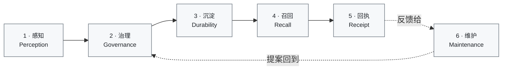
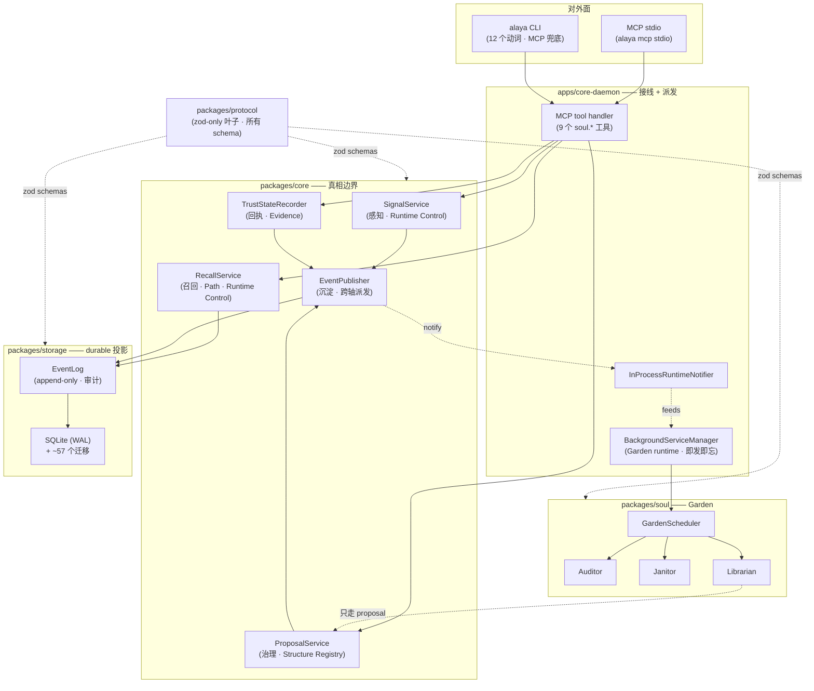

<div align="right">

[English](README.md) | **简体中文**

</div>

<div align="center">

# Do-SOUL Alaya

### *给 CLI 编码 agent 的本地优先记忆平面。*

[](#接下来的方向)
[](LICENSE)
[](#接下来的方向)
[](#快速开始)
[](#快速开始)
[](#架构总览)
[](#架构总览)
[](#对外面mcp--cli)

[**问题**](#问题) ·
[**设计语法**](#关于记忆的思考方式) ·
[**记忆的生命周期**](#记忆的生命周期) ·
[**架构**](#架构总览) ·
[**快速开始**](#快速开始) ·
[**路线图**](#接下来的方向)

</div>

---

## 问题

CLI 编码 agent 的"记忆"其实是一次会话——终端关掉，记忆就没了。两
个 agent 在同一个项目上各干各的，谁也不知道对方学到了什么。手动复
制粘贴上下文，能撑过一个项目就不错了。

你可以塞一个向量数据库进去打补丁。但向量库回答的是 *"和这串文字相
似的是什么"*，而不是 *"关于这个项目，什么是真的"*。**相似不等于真
相，向量不等于证据。** 一个按余弦距离排序的召回，可以流畅、自信、
而且错——agent 会照着错的去执行。

记忆不是单一问题。它有阶段——**感知、治理、沉淀、召回、回执、维
护**——每个阶段都有自己的失败模式。感知阶段如果直接写 durable，
agent 就能凭幻觉造真相；召回阶段如果让 embedding 压过证据，相似
就战胜了事实；维护阶段如果绕过治理直接动 durable，审计就死了。
**Alaya 做的是：把每个阶段的纪律分开守，再用一条"真相归属"的不变
量把它们串起来。**

它就跑在你的 agent 旁边——通过 MCP attach、通过 CLI 脚本——所有
东西落在一个你自己的 SQLite 文件里。没有聊天界面、没有遥测、召
回路径上没有任何云端往返。

---

## 关于记忆的思考方式

两组坐标支撑起整个系统。它们就是设计语法——下文每一段都会回头引
用这两组。

**三层** —— 运行时实际穿过的层：

| 层 | 这一层装的是 | 例子 |
|---|---|---|
| **Memory Ontology（记忆本体）** | 持久的语义真相 | `EvidenceCapsule`、`MemoryEntry`、`SynthesisCapsule`、`ClaimForm` |
| **Structure Registry（结构注册）** | 路由、绑定、仲裁、可见性 | `PathRelation`、`ConflictMatrix`、`ManifestationDecision` |
| **Runtime Control（运行时控制）** | per-turn 装配、网关、投影 | `RecallQuery`、`ActivationCandidate`、`ContextPack`、`TrustSummary` |

**四轴** —— 真相归属：

- **Object 轴** —— *记什么*：稳定的、带 facets 的语义单元；时间、情境、风险、责任都是对象的 *facet*，不是外挂标签。
- **Path 轴** —— 对象之间可学习的条件关系。**召回、预测、提醒，全部是 path 在运行时的"显化"，而不是独立子系统。**
- **Evidence 轴** —— 一个 claim 由什么支撑、支撑如何衰减（包含对象证据 + path 的可塑性：reinforcement / weakening / redirection / retirement）。
- **Governance 轴** —— 谁赢、谁冲突、谁要复审、谁过期；同时也限制一条学到的 path 在单一 turn 里能施加的最大影响。

**让记忆不腐烂的那条不变量：**

> 一个 object / index / state 只能在 **唯一一根轴** 上做 source-of-truth。
> 其它轴可以引用它，但不能默默替换它。

正是这条规则，让召回（Path 轴）可以伸进证据（Evidence 轴）和本体
（Object 轴），而不会偷偷修改它们。下面六个阶段，每一段都明确地
遵守这条不变量——而 v0.1 里还没遵守得足够干净的地方，全部在
[路线图](#接下来的方向) 里点名。

---

## 记忆的生命周期

六个阶段。每一个阶段都是对一种具体失败模式的回答——这些失败模式
都是我在那些忽略上述设计语法的 agent-memory 系统里反复看到的。



读法：agent 感知到 → 治理来决定 → 决定落成持久 → 后续的 turn 召
回 → agent 回报这次召回有没有用上 → 维护去审计、压缩、把发现的问
题作为"提案"再丢回治理。**没有任何路径可以绕开治理写 durable。**

### 1. 感知 (Perception)

**这一步在做什么。** Agent 通过 `soul.emit_candidate_signal` 发
出一个 *candidate signal*——*"我觉得这条值得记"*。信号会被持久
化（这样它能跨过这一 turn），但 **不会** 修改本体真相。一个
triage（分诊）步骤决定它的去向：低置信度 + 无证据 → 暂缓；否
则 → 可能流入 proposal 通道。

**这一步不这么做会出什么问题。** 如果感知阶段就能写 durable，那
么任何"流畅但错"的断言都会变成事实。模型的自信，就成了系统的真
相模型。

**设计选择。** 信号即 proposal，不是 fact。把分诊放在边界，而不
是放到召回时再去补救。信号本身在 **Runtime Control 层** 是持久
的；本体真相（Memory Ontology 层 / Object · Evidence 轴）在后
续阶段同意之前完全不动。

*代码锚点：* `packages/core/src/signal-service.ts:80-130`、
`packages/core/src/signal-service.ts:270-283`（分诊门）。

### 2. 治理 (Governance)

**这一步在做什么。** 经过分诊的信号可以变成 `Proposal`，状态为
`PENDING`。Reviewer（一个被人指示去复审的 agent，或脚本化的角
色）调用 `soul.review_memory_proposal`，给出 `accept` 或
`reject`。Accept 会级联到 Synthesis 晋升、Claim 激活、以及对受
影响 object 的 karma 记录。

**这一步不这么做会出什么问题。** *"agent 说的"* 不是治理论据。
没有显式的 accept 步骤，每一次修改都会变成静默 merge。

**设计选择。** Propose / review 是两个独立的 MCP 工具，落在
**Governance 轴** 上。晋升过程中的状态记账（Synthesis 状态、
Claim 生命周期、karma）落在 **Memory Ontology 层 / Object 轴**，
但只通过 proposal-resolution 这条路径才会变。

*v0.1-closeout 已收口（A1）：* daemon 现在暴露了
pending-proposals 队列（`soul.list_pending_proposals` MCP 工具），
review 记录带上了显式 `reviewer_identity`（migration
`058-reviewer-identity.sql`），`alaya review pending|accept|reject`
CLI 动词已接入，Inspector 也加了对应队列页。HITL 现在是 *daemon
编排* 的——MCP / HTTP loopback / CLI 三条路共享同一个 workflow
契约。完整的 review-inbox UX（reviewer 分配、deadline、escalation、
multi-reviewer quorum）是 [接下来的方向](#接下来的方向) 里的
`#BL-027`。

*代码锚点：*
`apps/core-daemon/src/mcp-memory-proposal-workflow.ts:90-248`、
`packages/core/src/proposal-service.ts:218-317`。

### 3. 沉淀 (Durability)

**这一步在做什么。** 治理一旦 accept，变更走一条固定流水线：
**EventLog append → DB 写入 → 进程内 notify**。EventLog 仅追加，
是"审计的总账"；DB 是 EventLog 的可查询投影；notify 是进程内对
后台 listener 的 fan-out（Garden 等）——**不是 SSE，不是网络广
播**。

**这一步不这么做会出什么问题。** DB-first 的写法意味着审计在追
赶数据库——而那段缝隙，正是不可追溯状态溜进去的地方。EventLog-
first 意味着 *audit precedes broadcast*：任何 listener 都不会看
到 EventLog 无法回放的状态。

**设计选择。** 一个统一的边界
`EventPublisher.publishWithMutation()`。Durable 写入永远把一行
EventLog 和 DB 修改成对出现；下游 consumer 订阅的是 notify，不
是 DB。落在 **Memory Ontology 层（durable truth）+ Runtime
Control（dispatch）**。

*v0.1-closeout 已收口（A2）：* append + mutation 这一对现在已经
落进单一 `connection.transaction()` —— `EventPublisher` 上新增的
`appendManyWithMutation` 边界承担这一职责。`(entity_type, entity_id,
revision)` 唯一索引仍然保留作为兜底，但已不再是承载 invariant 的关键
路径。14 个 producer service 全部迁移完毕；旧的 `publishWithMutation`
/ `publishManyWithMutation` 标了 `@deprecated`，只剩一个 auditor
adapter 还在用（追踪为 `#BL-026`）。`#BL-022` 已关闭。

*代码锚点：* `packages/core/src/event-publisher.ts:40-62`、
`packages/storage/src/repos/event-log-repo.ts:69-118`。

### 4. 召回 (Recall)

**这一步在做什么。** `soul.recall` 按固定顺序跑四个策略：

1. **Coarse filter（粗筛）** —— 确定性匹配（scope / dimension / domain tags）+ HOT 分层上的预计算激活分。
2. **FTS 补充** —— 在已筛集合内做全文检索补充。
3. **Fine assessment（精排）** —— 预算感知的加权排序：`activation × base + relevance + graph support − budget penalty − conflict penalty`。
4. **Embedding 补充** —— **只做加性 boost，不能 override**。

Agent 收到的是 `delivery_id` 加结果项 + pointers；内部的
`ContextPack` 投影留在 Alaya 内部，不外送。

**这一步不这么做会出什么问题。** 任何 agent-memory 系统最诱人的
失败方式，就是让 embedding 决定真相。余弦距离很流畅、很自信，而
且它是"反向也成立"的——一句意思相反但措辞相似的句子，分数照样
高。

**设计选择。** Embedding 不能 override 词法 / FTS / path 的排
序——只能在 base 分数之上加一个被 clamp 过的、加权过的 boost
（similarity ∈ [0, 1]，权重 0.8）。Embedding 服务缺失、配置错、
返回为空，召回都会静默回退到词法路径，不抛错。Recall 落在
**Path 轴**（召回 *本身* 就是 path 在运行时的显化）和 **Runtime
Control 层**。

*代码锚点：* `packages/core/src/recall-service.ts:189-315`（编
排）、`packages/core/src/recall-service.ts:501-581`（embedding-
supplement merge —— 用代码证明 boost 是加性的，永远不 override）。

### 5. 回执 (Receipt)

**这一步在做什么。** Delivery 之后，agent 通过
`soul.report_context_usage` 回报
`used | skipped | not_applicable`。Alaya append 一行
`MEMORY_USAGE_REPORTED` EventLog，并保存一条 `UsageProofRecord`，
关联回原来的 `delivery_id`。这条数据进入 `TrustSummary` 的计
算——量化"*delivered ≠ used*"。

**这一步不这么做会出什么问题。** 没有回执，*"delivered"* 会悄悄
膨胀成 *"useful"*。召回的统计数据会显得很漂亮，因为没有任何东西
被标为没用过；系统在为 agent 根本没用上的工作给自己鼓掌。

**设计选择。** Receipt 是 **advisory（即发即忘）**——agent 可
以不报，Alaya 会退化到 `delivered` 这个 trust 状态，不会报错。
落在 **Evidence 轴**（作为 control-plane 证据）+ **Runtime
Control 层**。

*v0.1-closeout 已收口（A3）：* 回执现在喂给 Path 轴可塑性 —— 新
`PathPlasticityService`（`packages/core/src/path-plasticity-service.ts`）
被 Garden Auditor 的 `path_plasticity_update` 任务消费。schema 字段
原本就在（`packages/protocol/src/soul/path-relation.ts:113-124`），
service 把对应的 `PathRelationReinforced/Weakened/Retired` 事件
（来自 `packages/protocol/src/events/runtime-governance.ts`）发出来，
`RecallService` 把可塑性权重纳入召回评分。v0.1 实现规范里 4 个 op
中的 3 个（reinforcement / weakening / retirement）；
`direction_bias` redirection 是 `#BL-029`。

*代码锚点：* `apps/core-daemon/src/trust-state.ts:147-187`、
`packages/protocol/src/soul/mcp-types.ts:146`（三态 enum）。

### 6. 维护 (Maintenance)

**这一步在做什么。** Garden 是一个即发即忘的后台系统，按 tier 调
度四个角色：

- **Auditor** —— 证据陈旧检查、pointer 健康度、孤儿检测。
- **Janitor** —— TTL 清理、热/温分层降级、休眠标记、墓碑 GC。
- **Librarian** —— 合并检测、模板聚类、邻居发现、path 压缩。
- **Scheduler** —— 拥有队列、tier 优先级、冷却期、任务记账。

**这一步不这么做会出什么问题。** 一个直接写 durable 的维护系统，
等于绕过了治理；一个和召回同步跑的维护系统，等数据集长大就会把召
回的预算吃光。Garden 哪个都不做。

**设计选择。** Garden 角色 **永远不直接写 durable**。Janitor 和
Auditor 调用窄口径的 maintenance ports，最终也是走
`EventPublisher.publishWithMutation()`，所以 EventLog 仍然是审
计源。Librarian 只生成 *proposals*，把发现的问题再丢回 Governance
——这正是生命周期图里 Maintenance 的虚线箭头回到 Governance、而
*不是* 回到 Durability 的原因。Garden 是不变量级别的"即发即忘"：
**Garden 慢了，召回也不会跟着慢。**

*代码锚点：* `packages/soul/src/garden/auditor.ts:62-89`、
`packages/soul/src/garden/janitor.ts:83-120`、
`packages/soul/src/garden/librarian.ts`、
`apps/core-daemon/src/garden-runtime.ts:98-111`（Scheduler 的
EventLog 接线）。

---

## 架构总览

各个 package 干净地映射到设计语法上——每一个都拥有特定的
"层 / 轴"组合，而依赖方向防止 truth boundary 被泄漏。



CI 测试强制的规则：

- `packages/protocol` 只依赖 `zod`——它是叶子，所有其它 package
  都消费它的类型。
- `packages/core` 是真相边界。Storage 是它后面的机械化持久层；
  storage 不决定真相。
- 状态变更遵循 **EventLog → DB 写 → notify**，永远不是 DB-first。
- Garden 即发即忘；慢任务不能阻塞召回。
- `packages/engine-gateway` 只做 provider 路由——没有业务逻辑、
  没有反向回到 core 的路径。

---

## 对外面：MCP + CLI

两个对外面，一套 runtime。Agent 走 MCP attach；人走 CLI 脚本。
两个面都通过同一个 daemon、同一个真相边界。

### MCP 工具（9 个 `soul.*`）

全部 schema-bounded；`maxLength`、`maxItems`、
`additionalProperties: false` 都是从 zod 请求 schema 派生的，在
解析时和发布的目录里都强制执行。

| Tool | 阶段 | 修改 durable？ |
|---|---|---|
| `soul.recall` | 召回 | 否 |
| `soul.open_pointer` | 召回（按 id 读） | 否 |
| `soul.explore_graph` | 召回（一跳邻居） | 否 |
| `soul.emit_candidate_signal` | 感知 | 是（proposal-side） |
| `soul.propose_memory_update` | 治理入口 | 是（proposal-side） |
| `soul.review_memory_proposal` | 治理裁决 | 是 |
| `soul.list_pending_proposals` | 治理分诊（HITL 队列） | 否 |
| `soul.apply_override` | Runtime Control（session 局部，永远不进 durable） | 是（session-scope） |
| `soul.report_context_usage` | 回执 | 是（audit） |

`alaya tools list --json` 和 `alaya tools call <tool> '<json>' --json`
是同一套接口的 CLI 兜底——用来在 agent runtime 之外做脚本化。

### CLI 命令（12 个动词）

| 命令 | 用途 | 修改？ | 审计日志？ |
|---|---|---|---|
| `alaya doctor` | 诊断环境、storage 健康、schema 版本、daemon 可达性 | 否 | 否 |
| `alaya install` | 规划 / 应用 / 回滚一份安装 profile | 是 | 是 |
| `alaya attach codex` | 给 `~/.codex/config.toml` 写 `mcpServers.alaya` | 是 | 是 |
| `alaya attach claude-code` | 给 `~/.claude.json` 写 `mcpServers.alaya` | 是 | 是 |
| `alaya detach codex` / `detach claude-code` | 原子地反向解除对应的 attach | 是 | 是 |
| `alaya status` | Daemon 健康 + trust-state 摘要 | 否 | 否 |
| `alaya inspect` | 在 loopback 上打开 Memory Inspector SPA（memory-tooling，*不是* agent surface） | 否 | 否 |
| `alaya tools list` | 列 MCP 工具目录 | 否 | 否 |
| `alaya tools call <tool> '<json>'` | 从 CLI 调一个工具 | 视情况 | 视情况 |
| `alaya review pending\|accept\|reject` | 查看并裁决 HITL proposal 队列（Memory Inspector 的 CLI 兜底） | accept / reject：是 | 是 |
| `alaya backup --output <path>` | 可携带备份包（已签名） | 否 | 是 |
| `alaya export --output <path>` / `import --bundle <path>` | 可携带导出 / 导入 | 导出否 / 导入是 | 是 |
| `alaya mcp stdio` | 跑 daemon 的 MCP stdio 服务（attach 接的就是这个） | 否 | 否 |

每个会修改的动词都支持先 preview 再写。`attach` 和 `detach` 是
原子的。审计日志在 `~/.config/alaya/audit/`。

---

## 快速开始

不需要 `git`、Node 20+、pnpm 9+ 之外的任何东西。`CLAUDE.md` 里
的 `rtk` 引用是 Claude Code 的 token 优化，纯 `pnpm` 同样能跑。

```bash
# 1) clone
git clone https://github.com/tdwhere123/Do-SOUL-Alaya.git
cd Do-SOUL-Alaya

# 2) 检查宿主依赖
node --version    # >= 20.19.0
pnpm --version    # >= 9

# 3) 装依赖
pnpm install

# 4) build（编译每个 package；产物在 apps/core-daemon/dist/）
pnpm build

# 5) doctor —— 验证环境、storage schema_ok、daemon 可达性
pnpm alaya doctor
#   期望：checks.environment = ok，storage.schema_ok = true（已配置情况下）
#   全新 clone 时，daemon 没起，garden 状态会读到 `degraded`，
#   doctor 退码 75。这是 advisory，不是硬错。

# 6) install 一份 profile —— 在指定路径建 alaya.db 并写 audit log
pnpm alaya install --non-interactive '{"db_path":"./alaya.db","embedding_enabled":false}'
#   如果 ~/.config/alaya/ 下已有配置，可以跳过这步。

# 7) attach 你的 agent —— 写 ~/.claude.json（或 ~/.codex/config.toml）
pnpm alaya attach claude-code      # preview，确认，再 apply
#   随时可以用 `pnpm alaya detach claude-code` 干净撤销。

# 8) 第一次 tool call —— 端到端验证 MCP 接口
pnpm alaya tools list --json | jq '.tools | length'
#   期望：9

pnpm alaya tools call soul.recall \
  '{"query":"hello","scope_class":null,"dimension":null,"domain_tags":null,"max_results":5}' \
  --json
#   期望：{ "delivery_id": "...", "results": [...], "total_count": <int> }
```

走完第 7 步，agent 下次启动就会把 Alaya 当 MCP server 看，9 个
`soul.*` 工具在 agent 内部就可以调了。

**某一步失败时：**

- `pnpm alaya doctor` 会告诉你具体哪一项检查失败（环境、storage、
  daemon、MCP 传输）——第一站。
- `pnpm alaya install --plan-only '<json>'` 在 apply 前看 diff。
- `pnpm alaya detach codex`（或 `claude-code`）原子撤销 attach，
  并写自己的审计条目。
- Storage 看上去出问题时，`alaya.db.shm` / `alaya.db.wal` 是 WAL
  正在工作，不是损坏。`alaya doctor` 会在 schema 版本对不上时
  告警。

---

## 仓库布局

```
Do-SOUL Alaya/
├── apps/
│   ├── core-daemon/             Hono HTTP + MCP stdio + CLI 入口
│   └── inspector/               Memory Inspector SPA（loopback memory-tooling，不是 agent surface）
├── packages/
│   ├── alaya-protocol/          zod schema（真相边界的叶子）
│   ├── alaya-storage/           SQLite + ~57 个有序迁移
│   ├── alaya-core/              services（signal / proposal / claim / evidence / recall / trust / ...）
│   ├── alaya-soul/              Garden 角色（Auditor / Janitor / Librarian / Scheduler）
│   └── alaya-engine-gateway/    只做 provider 路由（没有业务逻辑）
├── docs/
│   └── handbook/                invariants、code-map、runtime-status、workflow
├── bin/alaya.mjs                CLI shim（`pnpm alaya …` 用的就是它）
├── README.md / README.zh-CN.md
├── CLAUDE.md                    给 agent 贡献者的指引
└── LICENSE
```

---

## 接下来的方向

> **状态说明（2026-05-05）。** v0.1.0 已发布。v0.1 一开始（2026-05-03）
> 被过早写成了"已发布"，后来我把它重开，把第一轮 release 里被 deferred
> 的三处结构性差距 —— HITL daemon 骨架 (A1)、EventPublisher 原子事务
> (A2)、Path 轴可塑性反馈环 (A3) —— 加上 C1 hygiene wave 一起纳进收尾
> 范围。这四张卡都通过 `v0.1-closeout` 落地，过了 6-lens D2 多智能体复审
> + 2 轮 Codex fix-loop，已合入 `main`。v0.2 工作继续按下面这些 backlog
> 卡推进。

### P1. v0.1 已收口 —— closeout cards

| 卡 | 关闭的事 | Backlog |
|---|---|---|
| **A1** 已落地：Daemon HITL 骨架 | `soul.list_pending_proposals` MCP 工具 · `alaya review pending\|accept\|reject` CLI · review record 上加 `reviewer_identity` · Inspector "Pending Proposals" 视图 | 新卡 |
| **A2** 已落地：EventPublisher 原子事务 | `appendManyWithMutation` 落进单一 `connection.transaction()`；14 个调用点改成同步 mutate；关掉竞态窗口 | `#BL-022` 已关闭 |
| **A3** 已落地：Path 轴可塑性反馈环 | 新建 `PathPlasticityService` 消费 `MEMORY_USAGE_REPORTED` → 发 `PathRelationReinforced/Weakened/Retired` runtime-governance 事件 → `RecallService` 把可塑性纳入打分 | 新卡 |
| **B1** `pi-mono` 集成 | `packages/engine-gateway` 变成 `pi-mono` 客户端；synthesis / proposal scoring / reflection 走一个干净的 provider 边界 | `#BL-008` |
| **B2** OS keychain 支持 | `keychain:<service>:<account>` secret-ref 语法；macOS Keychain + Linux libsecret 适配器（Windows 走 mock） | `#BL-009` |
| **C1** 已落地：文件形态卫生 wave | protocol `phase-*.ts` 文件/符号已改为 domain 命名（如 `events/runtime-governance.ts`）；超大文件已拆分；固定版本 `knip` unused-code 检查已接入；`code-map.md` 已刷新 | `#BL-017` 已关闭 |

剩余 closeout 工作都在隔离 worktree 里跑，每张卡都按 review +
fix-loop 纪律收。只有当某张卡自己的退出条件成立、且综合 review
报告 zero Blocking / Important 后，`main` 才接收这张卡的 merge。

### P2. v0.1 之后 —— 走向以记忆为核心的 agent

等 `pi-mono` 成为 provider 边界（B1）、Path 轴可塑性闭上召回反
馈环（A3）之后，更长的弧线是 **以记忆为核心的 agent** —— 它的
内循环是围绕"读和写记忆"展开的，而不是围绕聊天。

那时候要继续拽的线头：

- **完整 review-inbox UX** —— 分配、deadline、escalation、多
  reviewer quorum。HITL 最小骨架（A1）是脚手架；这层是上面的团
  队工作面。
- **Embedding 策略调优** —— 保持"补充而非裁判"；做实验：boost
  权重、补充上限、按 domain 标定。
- **召回预算成形** —— 让 budget penalty 的衰减计划反映 agent
  真实的上下文窗口成本，而不是一个静态常数。

v0.1 closeout 期间开出的具体 v0.2 backlog 卡（详细关闭条件见
`docs/handbook/backlog.md`）：

- **`#BL-025`** —— 把 `EventPublisherInput`（计划中的类型，参见
  `#BL-025`）那个"必填但被静默覆盖"的 `revision` 字段从 ~50 处
  source 调用 + ~50 处测试夹具里去掉（纯类型 ergonomics；BL-022
  的实际竞争窗口在 v0.1 已经关掉了）。
- **`#BL-026`** —— 把 soul 端的 `AuditorEventLogPort` 适配器从
  `publishWithMutation` / `publishManyWithMutation` 这俩 legacy
  签名上迁移走，让那两个 `@deprecated` 方法（以及那个把
  `appendSync?` / `transactional?` 误标为可选的 port shape）可以
  删除。
- **`#BL-027`** —— 在 A1 落地的最小 HITL daemon 骨架之上做完整
  review-inbox UX（assignment / deadline / escalation / 多 reviewer
  quorum），并把 `reviewer_identity` 从 agent 自报字段升级为后端
  从 session credential 绑定（关掉 invariants §21b 的限制）。
- **`#BL-028`** —— 把 `PATH_PLASTICITY_UPDATE` 任务从 Auditor
  (TIER_1) 挪到 Librarian (TIER_2)，严格对齐 glossary 里
  ConsolidationLoop 的分层。
- **`#BL-029`** —— 在 v0.1 交付的 reinforcement / weakening /
  retirement 之上接入 `direction_bias` redirection（第四种 plasticity
  op）。
- **`#BL-030`** —— 给 `PathLifecycle` 加 `status: "active" | "retired"`
  字段，把每 tick 的 audit-log 扫描和 recall 端基于 strength 的
  retirement 推断都下掉。
- **`#BL-031`** —— Sync-first 的 repo 模式 —— 把 A2 加的那批并列
  `*Sync` 兄弟方法回收掉：让主方法变成同步、只在 I/O 边界包一层
  async。
- **`#BL-032`** —— 给 path-plasticity 加 EventLog 的工作区+类型
  组合查询（消掉那个把 Auditor 整 tier 卡住的内存过滤）。
- **`#BL-033`** —— 在 recall 的 plasticity port 上做批量
  `findByAnchors`，干掉 recall 热路径上的 N×M 来回。
- **`#BL-034`** —— 一个 review-surface contract-parity 测试，覆盖
  MCP / Inspector HTTP / `alaya review` CLI 三条路。
- **`#BL-035`** —— 把 path-plasticity 每工作区的 watermark 落进
  SQL，让 daemon 重启不再用一次 24h lookback。
- **`#BL-036`** —— 用 `Set<workspaceId>` 镜像 embedding-backfill
  的去重模式，给 pending 的 `PATH_PLASTICITY_UPDATE` 加 enqueue 去重。

---

## 贡献

欢迎 PR。开 PR 之前：

1. 先读 `docs/handbook/invariants.md`——架构上的不可让步项
   （真相边界、轴、EventLog 顺序、Garden 隔离）。
2. 本地跑 `pnpm build` 和 `pnpm test`，必须都绿。
3. 改 `packages/*` 或 `apps/core-daemon/src/` 的时候，把改动收
   敛在 PR 描述里点名的范围内——不要在同一个 PR 里顺手重构邻
   近文件。
4. 新行为至少要带一个测试：在你的修改之前会失败、之后会通过。

涉及更大结构（新增一个 MCP 工具、新增一个 Garden 角色、新增一种
跨轴交互）——先开 issue 对齐形态。

---

## 致谢

- [`better-sqlite3`](https://github.com/WiseLibs/better-sqlite3) —— 本地 SQLite 驱动。
- [`Hono`](https://hono.dev) —— daemon 用的 HTTP 框架。
- [`zod`](https://zod.dev) 与 [`zod-to-json-schema`](https://github.com/StefanTerdell/zod-to-json-schema) —— 公开 MCP 目录的单一真相源。
- [`Vitest`](https://vitest.dev)、[`pnpm`](https://pnpm.io)、[`tsup`](https://tsup.egoist.dev)，以及 Model Context Protocol 规范。

---

## License

[MIT](LICENSE) © 2026 Do-SOUL Alaya contributors
