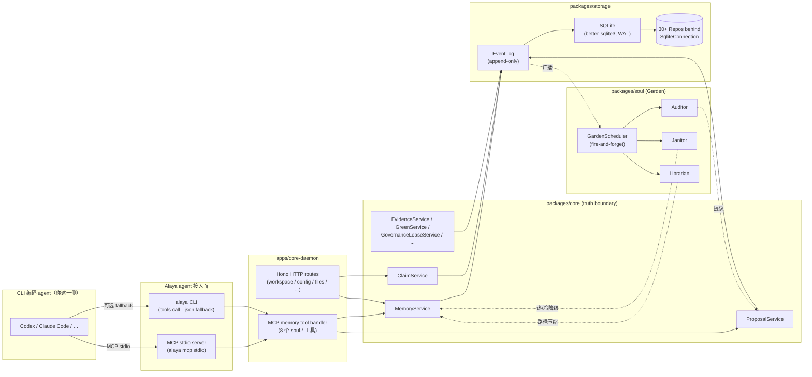
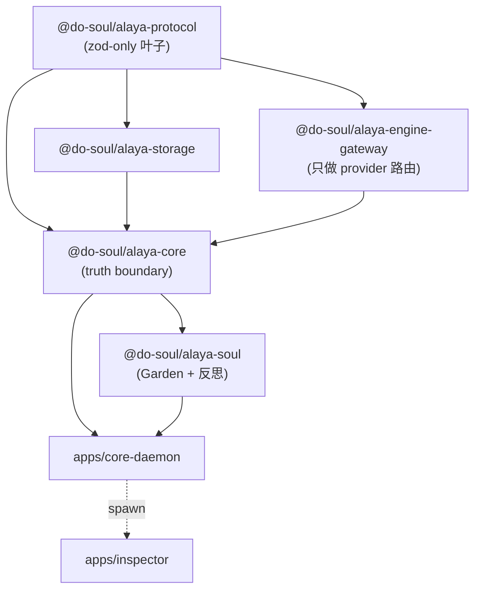

<div align="right">

[English](README.md) | **简体中文**

</div>

<div align="center">

# Do-SOUL Alaya

### *给 CLI 编码 agent 用的本地优先记忆面。*

Codex、Claude Code、任何 MCP 兼容的 agent 通过 MCP 接入，就能拿到跨会话
的、有证据支撑的持久记忆。没有聊天 UI，没有埋点，没有云。只有一个你
自己掌控的 SQLite 文件。

[](#状态与路线图)
[](LICENSE)
[](#状态与路线图)
[](#快速开始)
[](#快速开始)
[](#架构)
[](#架构)
[](#mcp-工具面)

[**快速开始**](#快速开始) ·
[**它是什么**](#alaya-是什么) ·
[**对比同类**](#alaya-与同类对比) ·
[**架构**](#架构) ·
[**路线图**](#状态与路线图)

</div>

---

> **要解决的问题。** CLI 编码 agent 一旦会话结束就把所有东西忘了。
> 同一个项目里两个 agent 之间也不共享它们各自学到的东西。手工粘贴
> 上下文这条路，能撑过的项目数量大概是一个，再多就崩。
>
> **Alaya 做什么。** 它在你 agent 旁边跑，提供一层 *记忆面*：带证据
> 的持久 capsule、治理 gate、多路径 recall，以及一个由后台角色组成的
> Garden，在你工作的同时审计、压缩记忆。Agent 提议、Alaya 决定什么
> 才能成为真相。

本仓库是 [`do-what-new`](https://github.com/tdwhere123) 项目记忆子系统
的 **port**，上游冻结快照位于 `vendor/do-what-new-snapshot/`。v0.1.0 是
第一个把这个 port 端到端接通、并通过 CLI + MCP 暴露出来的版本。

---

## Alaya 的卖点

- **本地优先是设计前提。** 一个 SQLite 文件，就在你硬盘上，随时可以用
  `sqlite3` 打开。无 SaaS 锁定，无 auth dance，recall 路径上不绕云。
- **靠证据 gating，不靠 embedding gating。** 持久记忆必须有源。Embedding
  只是 recall 的 *补充*，永远不是真相裁定者 —— 它和证据冲突时，证据赢。
- **Agent 提议、Alaya 决定。** LLM 发出的是 *候选*；治理流程
  （Promotion Gate、必要时 HITL）决定什么变成持久记忆。**绝不存在**
  agent 一句话就能静默覆盖真相的路径。
- **MCP + CLI，不是 GUI。** 8 个 `soul.*` MCP 工具加 11 个 CLI 动词
  共享同一个 runtime。MCP 接入、CLI 脚本化、所有动作都进审计。
- **测试是真担活的。** 248 个文件、1917 个 test。v0.1.0 的 system
  review 里每一个 fix-loop 都走了原子 re-review 才合并。
- **Port-first，不是 vibe rewrite。** 治理、EventLog、Garden、recall
  这些硬部分，**字节级** port 自一个已经在上游打磨过多个 release 周期
  的子系统。我们没有去重新 derive 已经能跑的东西。

---

## Alaya 与同类对比

|  | Alaya | 向量数据库（chroma / qdrant / pgvector） | RAG 框架（langchain / llamaindex memory） | 聊天历史 / 上下文文件 |
|---|---|---|---|---|
| 真相模型 | 证据驱动、被治理 | 仅相似度 | pipeline 决定 | 没有模型 —— 文件就是文件 |
| 谁决定什么是持久 | 治理 gate | 谁写索引谁说了算 | 谁调 `.add()` 谁说了算 | 谁最后改的文件谁说了算 |
| 跨会话连续性 | 是（EventLog + capsule） | 取决于调用方 | 取决于调用方 | 手工粘贴 |
| Agent 集成 | MCP stdio + CLI | 库 SDK | 库 SDK | 无 |
| 可审计性 | EventLog + 每次 mutation 审计 | 索引日志（视实现） | tracing（视实现） | 提交了的话 `git log` |
| 存储 | SQLite（你掌控的一个文件） | server / 托管集群 | 可插拔（常见为托管） | 普通文件 |
| GUI 依赖 | 无 —— 没有聊天 UI | 可选 dashboard | 常见是 notebook / app | 无 |
| 学习曲线 | 不变式多、运维少 | 不变式少、运维少 | 不变式中、视实现 | 零 |

Alaya 的对位是 **agent 的持久、可被防卫的记忆**，**不是**文档相似度
搜索。后者用向量库；两者可以组合。

---

## 目录

- [Alaya 的卖点](#alaya-的卖点)
- [Alaya 与同类对比](#alaya-与同类对比)
- [Alaya 是什么](#alaya-是什么)
- [Alaya 不是什么](#alaya-不是什么)
- [面向哪些用户](#面向哪些用户)
- [为什么坚持本地优先](#为什么坚持本地优先)
- [架构](#架构)
- [MCP 工具面](#mcp-工具面)
- [CLI 命令](#cli-命令)
- [快速开始](#快速开始)
- [项目目录结构](#项目目录结构)
- [状态与路线图](#状态与路线图)
- [这套代码是怎么来的](#这套代码是怎么来的)
- [贡献](#贡献)
- [致谢](#致谢)
- [License](#license)

---

## Alaya 是什么

CLI 编码 agent 旁边的一层 *记忆面*，持有它的长期记忆：项目事实、
决策、证据、对象之间的关系。两条核心理念决定了所有设计。

**真相 vs 视图。** 记忆本体（memory ontology）才是持久真相。所有你
能查到的 —— recall 结果、各种投影、Memory Inspector 看到的画面 ——
都是 **视图**，不是真相。视图可能漂移、可能错；底下的 capsule 才是
要替它扛事的部分。

**Agent 提议，Alaya 决定。** 接入的 agent（LLM）只发 *候选*：
"这个事实应该被记住"、"这条证据更新了那个 capsule"。候选要进治理
（Promotion Gate、必要时 HITL），过了才会变成持久记忆。**不存在**
"agent 说啥就自动写入" 的路径。

v0.1.0 已就位的能力：

- 带证据的 **记忆本体** —— `MemoryEntry`、`EvidenceCapsule`、
  `SynthesisCapsule`、`ClaimForm`，对持久真相做 gating
- **多路径召回** —— 词法、FTS、路径感知、embedding（可选 supplement）
- **被治理的晋升** —— Promotion Gate、HITL、Green 状态状态机
- **会话信任** —— *delivered ≠ used* 不变式贯穿端到端
- **Garden 自维护** —— Auditor / Janitor / Librarian + Scheduler，
  fire-and-forget
- **Profile / 密钥 / 导入导出 / 可移植备份** 操作集合
- 一个 **MCP server**（`alaya mcp stdio`）暴露 8 个 `soul.*` 工具，
  外加 CLI fallback 走同一面
- 一个 **Memory Inspector** SPA（`alaya inspect`），用于记忆工具化 ——
  *不是* agent 接入面

## Alaya 不是什么

直白讲清楚，便于你立刻判断 Alaya 适不适合你。

- **不是聊天产品。** 你不跟 Alaya 说话，agent 才跟它说话。
- **不是对话 TUI。** 没有 prompt loop、没有历史回看 UI。
- **不是向量数据库。** Embedding 是 recall 的 *补充*，**永远不决定**
  持久真相。证据赢。
- **不是 agent autopilot。** Alaya 不跑 agent、不生成代码、自己也不
  调任何模型。Garden 是被框死的后台维护，不是自主推理。
- **不给最终用户用。** 见下一节。

## 面向哪些用户

Alaya 的设计目标用户是 **跑 CLI 编码 agent 的工程师**：

- 你从终端驱动 Codex、Claude Code 或类似 agent。
- 你写代码 / 操作系统时，agent 跨会话的"记忆"对你是真痛点。
- 你能熟练用 `pnpm`、Node 20+、SQLite、MCP transport。

按项目不变式 §21a（`docs/handbook/invariants.md`）：

> 公开文案（README、营销介绍、leaderboard 披露、博客）必须把 Alaya
> 描述为面向 CLI agent（Codex / Claude Code / 类似）的记忆面，**不得
> 邀请非工程用户安装或运营 Alaya**。

如果你身边有非工程师在问 Alaya，**正确答案是"这个目前不是给你的"**，
而不是绕个 workaround 让他能跑起来。要触达非工程用户得开一个独立
的消费者产品，或者先改 §21 charter。

## 为什么坚持本地优先

整个记忆面就是一个 SQLite 文件（WAL 模式、busy-timeout 已调，~57 条
有序 migration）。

- **数据归属于你。** 它在你自己的磁盘上，是一个你随时可以用
  `sqlite3` 打开手动检查的格式。无 SaaS 锁定。
- **可离线跑。** Recall、propose、governance 不需要任何网络。可选的
  embedding supplement 可以配，但 v0.1.0 默认关闭。
- **可移植。** `alaya backup` / `export` / `import` 产出可签名的捆绑
  包，可以在不同机器之间搬。
- **可审计。** 治理、配置、import / export、备份、会话信任的每一处
  变更都写进 EventLog —— 它是 append-only 的，是状态回放的真相之源。

## 架构

### 运行时数据流



写入只发生在 daemon 这一处。Agent 永远不直接碰数据库；它走
MCP / CLI → daemon → service → EventLog → DB。Garden 角色读 EventLog
投影、产出新的 proposal（比如证据陈旧度审计），但**绝不绕开治理路径**。

### 包依赖方向



CI 测试强制：

- `@do-soul/alaya-protocol` 只依赖 `zod`，是叶子。
- 所有领域类型都来自 `@do-soul/alaya-protocol` —— `core`、`storage`、
  daemon 里**不存在**平行类型定义。
- `core` 是 truth boundary；storage 是它后面的机械持久化；storage
  **不决定真相**。
- 状态变更走 **EventLog → DB 更新 → 广播**，绝不允许 DB-first。
- Garden 相对请求路径是 fire-and-forget。慢的 Garden 工作不能阻塞
  recall。

### SOUL 三层模型

| 层 | 用途 | 关键对象 |
|---|---|---|
| Memory Ontology | 长期记什么 | `EvidenceCapsule`、`MemoryEntry`、`SynthesisCapsule`、`ClaimForm` |
| Structure Registry | 对象怎么定位 / 绑定 | `PathRelation`、`ActivationCandidate`、`ManifestationDecision` |
| Runtime Control Plane | 每一轮怎么组装记忆 | `RecallQuery`、`ContextPack`、`TrustSummary` |

## MCP 工具面

8 个工具，每个都有 schema 上限 —— `maxLength`、`maxItems`、
`additionalProperties: false` 由 zod 请求 schema 派生，并在 parse 期
与发布的 catalog 里**双向强制**。

| 工具 | 用途 | 是否会 mutate？ |
|---|---|---|
| `soul.recall` | 混合召回：词法 + FTS + 路径感知 +（可选）embedding 补充 | 否 |
| `soul.open_pointer` | 按 id 读一个记忆对象，仅返回公开投影 | 否 |
| `soul.explore_graph` | 按边类型 / 方向遍历某记忆节点的邻居；workspace 由 MCP context 绑定 | 否 |
| `soul.emit_candidate_signal` | 提交一个候选信号 —— agent 的"我觉得这个值得记一下" | 是（提议侧） |
| `soul.propose_memory_update` | 对一条 memory entry 提出有类型的修改提议 | 是（提议侧） |
| `soul.review_memory_proposal` | 仲裁一条 proposal：accept / reject（HITL 或治理角色） | 是 |
| `soul.apply_override` | 对某对象施加会话内的 override | 是（会话作用域） |
| `soul.report_context_usage` | 闭环一次 recall 投递的使用结果：used / skipped / not_applicable | 是（审计） |

提议或施加 override **本身永远不会**直接修改持久记忆，它们都得走治理
路径（Promotion Gate / HITL）。Recall 与图遍历是只读的。

`alaya tools list --json` 与 `alaya tools call <tool> '<json>' --json`
是同一面在 CLI 的 fallback，方便在 agent runtime 之外做脚本调用。

## CLI 命令

总共 11 个动词。所有动词都需要先跑过 `pnpm build`。

| 命令 | 用途 | 是否会 mutate？ | 是否写审计？ |
|---|---|---|---|
| `alaya doctor` | 诊断环境、存储健康度、schema 版本、daemon 是否可达 | 否 | 否 |
| `alaya install` | install profile 的 plan / apply / rollback（db 路径、embedding、engine 绑定） | 是 | 是 |
| `alaya attach codex` | 把 `mcpServers.alaya` 写进 `~/.codex/config.toml`（preview → confirm → apply） | 是 | 是 |
| `alaya attach claude-code` | 把 `mcpServers.alaya` 写进 `~/.claude.json`（preview → confirm → apply） | 是 | 是 |
| `alaya detach codex` / `detach claude-code` | 原子地反向撤销对应的 attach | 是 | 是 |
| `alaya status` | daemon 健康 + 信任状态摘要 | 否 | 否 |
| `alaya inspect` | 在 loopback 打开 Memory Inspector SPA（记忆工具化面） | 否 | 否 |
| `alaya tools list` | 列 MCP 工具目录（CLI 走 `tools/list` 的 fallback） | 否 | 否 |
| `alaya tools call <tool> '<json>'` | 从 CLI 调一个工具；适合脚本与 CI | 视工具 | 视工具 |
| `alaya backup --output <path>` | 可移植备份包（带签名） | 否 | 是 |
| `alaya export --output <path>` / `import --bundle <path>` | 可移植导出 / 还原 | export 否，import 是 | 是 |
| `alaya mcp stdio` | 跑 daemon 的 MCP stdio server（这是 `attach` 实际接到的命令） | 否 | 否 |

每个 mutating 动词都支持 preview-before-write。`attach` 与 `detach`
是原子的。审计日志在 `~/.config/alaya/audit/`，可以随时回查改了什么、
什么时候改的。

## 快速开始

除了 `git`、Node 20+ 与 pnpm 9+ 之外不需要任何额外依赖。`CLAUDE.md`
里出现的 `rtk` 是 Claude Code 上下文里的可选优化；裸 `pnpm` 也可以
跑通。

```bash
# 1) Clone
git clone https://github.com/tdwhere123/Do-SOUL-Alaya.git
cd Do-SOUL-Alaya

# 2) 检查宿主版本
node --version    # >= 20.19.0
pnpm --version    # >= 9

# 3) 安装 workspace 依赖
pnpm install

# 4) 构建（编译每个包；产出 apps/core-daemon/dist/）
pnpm build

# 5) Doctor —— 验证 env、storage schema_ok、daemon 是否可达
pnpm alaya doctor
#   预期: checks.environment = ok, storage.schema_ok = true（已配置时）。
#   fresh clone 时 garden 可能是 `degraded`，doctor 退出码 75 —— 这只是
#   提示性状态，不是 hard failure。daemon 起来之后（attach 把它接到 agent）
#   garden 会变 ok。

# 6) install profile —— 在你给的路径创建 alaya.db，并写入审计日志
pnpm alaya install --non-interactive '{"db_path":"./alaya.db","embedding_enabled":false}'
#   如果你已经在 ~/.config/alaya/ 下有 config，跳过这步即可。

# 7) Attach 到你的 agent —— 写入 ~/.claude.json（或 ~/.codex/config.toml）
pnpm alaya attach claude-code      # preview → confirm → apply
#   想撤销随时: pnpm alaya detach claude-code

# 8) 第一次工具调用 —— 端到端验 MCP 面
pnpm alaya tools list --json | jq '.tools | length'
#   预期: 8

pnpm alaya tools call soul.recall \
  '{"query":"hello","scope_class":null,"dimension":null,"domain_tags":null,"max_results":5}' \
  --json
#   预期: { "delivery_id": "...", "results": [...], "total_count": <int> }
```

第 7 步之后，下一次启动 agent 时它就会把 Alaya 当作 MCP server 看到；
agent 内部就可以调那 8 个 `soul.*` 工具了。

**任何一步出错时：**

- `pnpm alaya doctor` 会告诉你哪一项 check 失败（env、storage、daemon、
  mcp transport）。这是排查的第一站。
- `pnpm alaya install --plan-only '<json>'` 在 apply 之前先看 diff。
- `pnpm alaya detach codex`（或 `claude-code`）原子地反向撤销 attach；
  自带审计条目。
- 存储跑过会留 `alaya.db.shm` / `alaya.db.wal` —— 那是 WAL 工作状态，
  不是损坏。`alaya doctor` 会在 schema 版本对不上时告警。

## 项目目录结构

```
Do-SOUL Alaya/
├── apps/
│   ├── core-daemon/             Hono HTTP + MCP stdio + CLI 入口
│   └── inspector/               Memory Inspector SPA（loopback 记忆工具化，**不是** agent 面）
├── packages/
│   ├── alaya-protocol/          zod schemas（truth boundary 叶子）
│   ├── alaya-storage/           SQLite + ~57 条有序 migration
│   ├── alaya-core/              services（memory / proposal / claim / evidence / green / ...）
│   ├── alaya-soul/              Garden 角色 + 反思
│   └── alaya-engine-gateway/    provider 路由（无业务逻辑）
├── docs/
│   ├── handbook/                开发者文档导航
│   │   ├── README.md
│   │   ├── invariants.md
│   │   ├── port-protocol.md
│   │   ├── code-map.md
│   │   ├── runtime-status.md
│   │   ├── backlog.md
│   │   └── workflow/            agent-workflow / review-protocol / subagent-dispatch
│   └── v0.1/                    port 任务卡（INDEX.md 是入口）
├── vendor/
│   └── do-what-new-snapshot/    冻结的上游源（port-first 的参照）
├── bin/alaya.mjs                CLI shim（`pnpm alaya …` 调它）
├── README.md / README.zh-CN.md
├── CLAUDE.md                    给 agent 贡献者的指引
└── LICENSE
```

## 状态与路线图

这一节实事求是 —— 哪些做完了、哪些没做，写清楚。**不要被任何
"production-ready" badge 误导**。

### v0.1.0 —— 已发布

- HEAD `ac87e16`，发布日 2026-05-03
- Gate-5 已 close；**p5-system-review** 经 3 轮收敛（~37 条 atomic fix-commits）
- 248 个测试文件、**1917 个测试通过**
- 11 个 CLI 子命令全部接通
- 8 个 `soul.*` MCP 工具全部接通
- **Open backlog: 0**
- 防御性不变式入册：§21a（受众）、§29（默认作用域）、§30（在源头修复）、§31（单一并发源）

### v0.1.1 —— 规划中（Phase 6 marketing benchmark wave）

5 张 task card，全部当前 `not-started`：

- `bench-adapter` —— 接到用户选定的 OpenRouter 模型
- `bench-harness` —— 评测框架
- `bench-baselines` —— baseline 数据
- `bench-resume` —— 恢复机制
- `bench-readme` —— leaderboard 模板（这份 README 在这一步会补上真实数字）

外加 `#BL-017` hygiene wave（重命名 `phase-*.ts`、拆分五个超大文件、
清 `ts-prune` 残留、刷 code-map）。

**目前没有 leaderboard。** 这份 README 在 v0.1.1 落地之前**不会**显示
任何 benchmark 数字。

### v0.2 —— 已 deferred（每条都有显式 close condition）

| 编号 | 推迟内容 | 关闭条件 |
|---|---|---|
| `#BL-008` | `pi-mono` 集成（替代上游 `provider/ai-sdk-*.ts` 路由） | v0.2 把 synthesis / proposal scoring / reflection 路由经过 `pi-mono`。 |
| `#BL-009` | OS keychain 支持 | 加 macOS Keychain / Linux libsecret / Windows Credential Manager 适配；`secret-ref` 语法扩展到 `keychain:<service>:<account>`。 |
| `#BL-022` | EventPublisher 原子化 + EventLog revision 进事务 | 新增 `EventPublisherEventLogRepoPort.appendManyWithMutation`（同步 mutate 包在单个 `connection.transaction()`）；EventLog revision 计算挪进事务内；约 12 个调用点迁移。 |

在 v0.2 落地之前，`#BL-022` 用 SQLite CAS + migration 028 加的
`unique(entity_type, entity_id, revision)` 索引兜底，外加 invariants
§"EventPublisher mutation audit-id divergence"（`#BL-021`）显式登记
divergence。

## 这套代码是怎么来的

Alaya 是 `do-what-new` 项目记忆子系统的 **port**，**不是 clean-room
rewrite**。这是有意为之，读代码前最好先理解清楚。

冻结的上游快照在 `vendor/do-what-new-snapshot/` ——
`vendor/do-what-new-snapshot/SNAPSHOT_REF.md` 里写明了源 commit hash
跟稳定性承诺。

纪律（详见 `docs/handbook/port-protocol.md`）：

- **trivial-copy**（默认）：原样拷文件，只改 package 名 / import 路径。
- **adapt-and-port**（受限）：仅当目标接口不同（比如要注入
  `SqliteConnection`）才允许；每个 adapter 点都列在 task card 里。
- **requires-redesign**（少见）：默认禁止；需要用户显式批准 + Charter
  Authority 引用。

**为什么坚持 port-first 而非重写：**

- 上游子系统在 `do-what-new` 里已经被多个发布周期打磨过了。从零
  re-derive 它的所有决策，会损失数月去逐个重新发现潜伏 bug。
- Alaya 独有的接入面（CLI、install / attach / detach、doctor、Memory
  Inspector、profile / audit）**确实**是 greenfield —— 但它们包在
  port 好的核心外面，并不替代核心。

**坦诚承认的 tradeoff：**

- 一些上游的 tech-debt 跟着进来了（`phase-*.ts` 之类的命名、过大的
  文件）。已经登记为 `#BL-017`，跟 Phase 6 同船在 v0.1.x 的 hygiene
  wave 里收掉。
- v0.1 阶段我们选的是速度优先而非局部最优。第一次值得做大重构的
  时间点是 Gate-5 close —— 而那个时机我们正好通过 `#BL-017` wave
  顺手获得了。

## 贡献

欢迎外部 PR，但必须遵守 Port-First 纪律。具体地：

1. 按这个顺序读入门文档：
   `docs/handbook/README.md` → `docs/handbook/invariants.md` →
   `docs/handbook/port-protocol.md` → `docs/v0.1/INDEX.md` → 你打算
   认领的具体 task card。
2. 涉及 `packages/*` 或 `apps/core-daemon/src/` 的改动，PR 必须证明
   目标文件逻辑与 `vendor/do-what-new-snapshot/<src>` 字节相同
   （trivial-copy），或列出每一个 adapter 点（adapt-and-port）。
3. 不要写一个"更好的"重新实现去替换
   `vendor/do-what-new-snapshot/` 里已有的文件 —— 这种 PR 不论代码
   质量如何都会被拒。
4. `pnpm build` 跟 `pnpm test` 必须双绿；Review Protocol checklist
   （`docs/handbook/workflow/review-protocol.md`）必须报告 0 条
   Blocking / Important。

对于 Alaya 独有的接入面（CLI、install / attach / detach、Memory
Inspector 前端）路径不同 —— 那些是 `requires-redesign` 卡。详见
不变式 §24。

## 致谢

- [`do-what-new`](https://github.com/tdwhere123) —— 上游项目；这里
  的记忆子系统是它的 port。
- [`better-sqlite3`](https://github.com/WiseLibs/better-sqlite3) ——
  本地 SQLite 驱动。
- [`Hono`](https://hono.dev) —— daemon 的 HTTP 框架。
- [`zod`](https://zod.dev) 与
  [`zod-to-json-schema`](https://github.com/StefanTerdell/zod-to-json-schema)
  —— 公开 MCP catalog 的 single source of truth。
- [`Vitest`](https://vitest.dev)、[`pnpm`](https://pnpm.io)、
  [`tsup`](https://tsup.egoist.dev)，以及 Model Context Protocol 规范。

## License

[MIT](LICENSE) © 2026 Do-SOUL Alaya contributors
